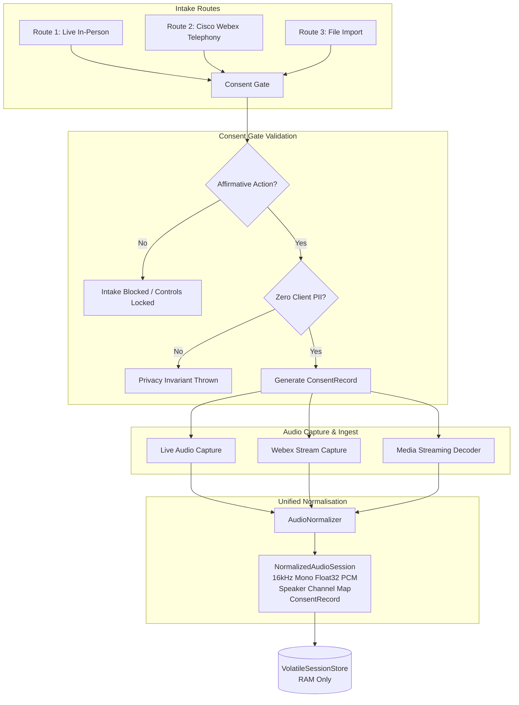

# Consent Gate, Telephony Intake & Audio Normalisation

**Case Ace v2.0 Architectural Specification & Compliance Guide**  
*Citizens Advice Wandsworth (CAW) — Advice Quality Standard Level 3 AI Pipeline*

---

## 1. Executive Summary & Regulatory Foundations

Case Ace v2.0 accepts advice consultations via three distinct routes:
1. **Live In-Person Interview** (workstation microphone capture)
2. **Telephone Call via Cisco Webex Calling** (WebRTC dual-channel telephony capture)
3. **Historical Recording File Import** (sandboxed browser decoding)

Under UK GDPR Articles 6(1)(a), 9(2)(a), and the Citizens Advice Data Protection Policy, recording any client advice consultation requires **affirmative, explicit, informed consent**. The **Consent Gate** is the common, non-bypassable architectural entry point across all three routes.



---

## 2. Phase 6.1: The Universal Consent Gate

### 2.1 Non-Skip Invariant
Recording cannot start, and file imports cannot be decoded, until the Consent Gate is affirmatively satisfied. There is no bypass, demo, or skip path in the codebase.

### 2.2 Route-Specific Consent Requirements

| Route | Timing & Mechanism | Adviser Guidance & Affirmation |
| :--- | :--- | :--- |
| **Live In-Person** | Client is in the room. Consent explained verbally before recording starts. | *"I confirm that I have explained these points to the client in terms they understood: (1) recorded for case note drafting, (2) temporary computer memory only, (3) destroyed when session ends, (4) raw voice never leaves workstation, (5) decline/withdraw with zero effect on advice."* |
| **Telephone via Webex** | Client is told at start of call. **Recording control is locked** until confirmed. | *"I confirm that I have informed the client on this call of the recording purpose and temporary memory retention, and the client has agreed to proceed."* *(The 'Start Recording Call' button is disabled until checked).* |
| **File Import** | Recording occurred previously or on external equipment. | **Explicit Professional Attestation** (not a simple checkbox): Adviser enters the stated original appointment date and specific means of consent (e.g. signed appointment agreement). Adviser makes formal professional statement. |

### 2.3 Zero Client PII Invariant
The consent record must **never** record the client's name, telephone number, National Insurance number, address, or any client identifier:

```typescript
export interface ConsentRecord {
  consentId: string;           // Random UUID (e.g. cst_8f3a...)
  consentedAt: string;         // ISO 8601 timestamp
  route: IntakeRoute;          // 'live_in_person' | 'webex_telephony' | 'file_import'
  adviserId: string;           // Adviser user ID (accountability)
  confirmedByAdviser: true;    // Explicit boolean affirmation
  originalAppointmentDate?: string; // YYYY-MM-DD (Imports only)
  importConsentMeans?: string;      // Method description (Imports only)
}
```

> [!IMPORTANT]
> **Audit Trail Invariant**: The link between the consent record and the client belongs strictly in **Casebook**, in the adviser's own case record notes, not in Case Ace.

### 2.4 Immediate One-Action Consent Withdrawal
Under UK GDPR Article 7(3), a client may withdraw consent at any time. When a client withdraws consent:
1. Activating the visible, always-accessible **"Withdraw Consent (Instant Destroy)"** button destroys the session immediately.
2. **Zero Confirmation Dialogues**: There is no "Are you sure?" modal delay.
3. All volatile session memory is wiped, recovery workers are terminated, and `ArrayBuffer` instances are zero-filled.
4. **Webex Telephony Call Continuity**: On a Webex call, consent withdrawal immediately ceases recording and destroys session data, but leaves the telephone call active so the adviser and client may continue their consultation unrecorded.

---

## 3. Phase 6.2: Route 1 Live Capture & Quality Controls

### 3.1 Web Audio Capture Architecture
* **Sample Rate:** 16,000 Hz (16 kHz).
* **Channels:** 1 (Mono Float32 PCM).
* **Storage:** Streamed in 4096-sample buffer chunks directly into volatile heap memory.

### 3.2 Persistent Recording Indicator
* **Sticky Top Bar:** Positioned at `top: 0` with `z-index: 1000`, visible across all scroll positions.
* **Flashing Badge:** Pulsing red indicator `● REC` with active elapsed timer (`MM:SS`).
* **Browser Tab Notification:** Synchronizes document title with `[● REC] Case Ace - Live Consultation`.

### 3.3 Volatile Memory Pressure Monitoring
To prevent out-of-memory crashes on CAW's 8GB RAM laptops, memory consumption is monitored in real-time (Float32 = 4 bytes/sample = ~3.84 MB/min):
* **Normal (`< 45 min` / `< 172.8 MB`):** Green indicator.
* **Moderate (`45 – 60 min` / `172.8 – 230.4 MB`):** Amber advisory.
* **High Memory Pressure (`60 – 90 min` / `230.4 – 345.6 MB`):** Red alert recommending interview conclusion.
* **Quota Limit (`>= 90 min`):** Hard stop preventing uncontrolled allocation.

### 3.4 Single Dominant Speaker Detection
* **Clinical Rationale:** If only the adviser's workstation microphone is active and the client is seated across the room or on speakerphone, the microphone may capture only the adviser's voice. A transcript missing client instructions will cause the drafting model to misstate what the client instructed.
* **Acoustic Algorithm:**
  1. Computes RMS energy across 100ms analysis frames.
  2. Dynamically estimates noise floor and partitions voiced frames into high-energy (close-mic) vs secondary-energy tiers.
  3. Evaluates turn-taking frequency.
  4. If one acoustic tier accounts for $\ge 88\%$ of voiced speech or if fewer than 2 conversational turns occur across $>20\text{s}$ of speech, surfaces an on-screen warning:
     > ⚠️ **Single Dominant Speaker Detected**: Single dominant speaker detected (94% speech dominance). Ensure the client's voice is clearly audible near the microphone so their instructions are accurately recorded.

---

## 4. Phase 6.2: Route 2 Cisco Webex Telephony Stream Capture

* **Gated Recording Control:** The "Start Recording Call" button is strictly locked until the adviser verifies client consent on the call.
* **Speaker Channel Splitting:**
  * **Channel 0:** Local adviser microphone.
  * **Channel 1:** Incoming remote client WebRTC telephone audio.
* **Decoupled Telephony Lifecycle:** Allows independent control of audio recording vs telephony call stream.

---

## 5. Phase 6.3: Audio Normalisation

### 5.1 Universal Normalized Representation
All three intake routes converge on `NormalizedAudioSession`:
* Format: `FLOAT32_PCM_16KHZ_MONO`
* Sample Rate: 16,000 Hz
* Channels: 1
* Speaker Map: `{ isDualChannel: boolean, adviserChannel?: number, clientChannel?: number, sourceType: ... }`
* Consent Record: Immutable `ConsentRecord`

### 5.2 Downstream Intake Agnosticism
Phases 7 through 14 (Pass 1 acoustic redaction, Speech-to-Text v2, tokenisation, LLM drafting, and Casebook clipboard handoff) consume only `NormalizedAudioSession` and have zero route-specific logic.

### 5.3 Non-Sensitive Intake Telemetry
To allow CAW quality assessors to measure whether note quality differs by intake route (e.g. comparing in-person vs imported audio), the frontend sends non-sensitive telemetry:
```json
{
  "stage": "intake_completed",
  "intakeRoute": "webex_telephony",
  "durationMs": 184500,
  "success": true
}
```
*Telemetries are scrubbed of all PII, client names, phone numbers, and session text.*
