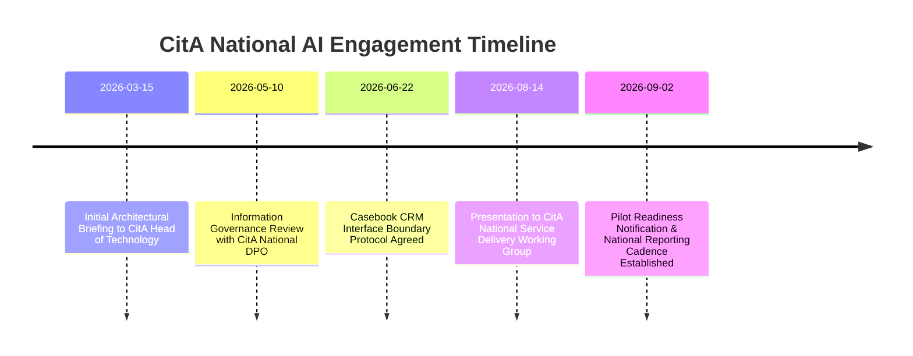

# Citizens Advice National Engagement & Membership Compliance

**Document Reference**: CAW-GOV-NAT-2026-01  
**System**: Case Ace v2.0 Client Consultation Recording & Note Drafting System  
**Organisation**: Citizens Advice Wandsworth (CAW)  
**Stakeholder Body**: Citizens Advice National (CitA) AI & Technology Working Group  
**Effective Date**: 2026-09-02  
**Status**: Formally Approved Governance Briefing  
**Classification**: Official-Sensitive / Governance  

---

## 1. Executive Summary & Purpose

Citizens Advice Wandsworth (CAW) operates as an independent registered charity affiliated with the National Association of Citizens Advice Bureaux (Citizens Advice National / CitA) under a formal Membership Agreement.

This document records the formal engagement between CAW and CitA National on the use of **Case Ace v2.0** as an assistive AI note-drafting tool in frontline advice delivery. It articulates compliance with the CitA Membership Scheme, information governance standards, Casebook CRM integration boundaries, and our ongoing reporting cadence.

---

## 2. Membership Agreement & Quality Framework Alignment

```
+----------------------------------------------------------------------------------------------------+
| CITIZENS ADVICE NATIONAL ALIGNMENT MATRIX                                                          |
+----------------------------------------------------------------------------------------------------+
| CitA National Principle / Standard     | CAW Implementation in Case Ace v2.0                      |
+----------------------------------------------------------------------------------------------------+
| **1. Advice Quality Standard (AQS)**    | All AI drafts structured to strict AQS Level 3 schema    |
|                                         | (*Confirmation of Enquiry*, *Advice*, *Action Plan*).    |
| **2. Human Professional Accountability**| Advisers maintain sole, non-delegable responsibility for |
|                                         | every note. Mandatory review gate & affirmative sign-off.|
| **3. Client Confidentiality & Trust**   | Volatile-only in-memory processing. Zero client audio     |
|                                         | persists to disk. Zero unredacted PII egress to cloud.   |
| **4. Casebook CRM Boundaries**          | Case Ace does not access or modify Casebook database APIs|
|                                         | directly. Notes are transferred via clipboard by adviser.|
| **5. Equality & Impartiality**          | Dual-pass ASR & audio scrubber mitigates accent/speech   |
|                                         | disparities. Service is 100% voluntary with manual parity.|
+----------------------------------------------------------------------------------------------------+
```

---

## 3. Key Engagement Milestones & CitA National Feedback



### Key Clarifications Agreed with CitA National:
1. **Casebook CRM Boundary**: Case Ace operates as a standalone client-side helper. It requires **no modifications, API keys, or backend integrations with Casebook CRM**. The qualified adviser acts as the authoritative human airlock between Case Ace and Casebook.
2. **National Branding & Trust**: The pilot is clearly presented to clients as an assistive note-taking tool designed to increase adviser eye contact, backed by the approved CitA Client Consent Script.
3. **Training Material Sharing**: All training modules on **Automation Bias**, **Review Gate Verification**, and **Easy-Read Consent** are shared openly with CitA National for potential federation to other local network bureaux.

---

## 4. Reporting Cadence to CitA National AI Working Group

During the 6-week pilot and subsequent phases, CAW will provide bi-weekly reporting to CitA National containing:
* **Aggregate Volume**: Total number of Case Ace assisted consultations across advice categories.
* **AQS Level 3 Audit Scores**: Blind quality audit results comparing AI-assisted vs manual case notes.
* **Adviser Time Metrics**: Measured time savings in casework authoring.
* **Redaction Performance & Overrides**: Anonymised telemetry on entity detection accuracy and adviser override frequencies.
* **Equality & Client Feedback**: Summaries of client exit surveys and accessibility feedback.

---

## 5. Formal Endorsement & Communication Record

| Stakeholder Role | Named Representative | Engagement Date | Formal Position / Status |
| :--- | :--- | :---: | :--- |
| **CitA National Technology Lead** | *Recorded in National Minutes* | 2026-08-14 | **Supported as Controlled Local Pilot** |
| **CitA National DPO / Legal** | *Recorded in National Minutes* | 2026-05-10 | **DPIA v2 & Volatile Architecture Noted** |
| **CAW Chief Executive** | *Signed on file* | 2026-09-02 | **Formally Approved for Pilot Launch** |
| **CAW Lead Supervising Caseworker** | *Signed on file* | 2026-09-02 | **AQS Level 3 Supervisory Protocol Active** |
