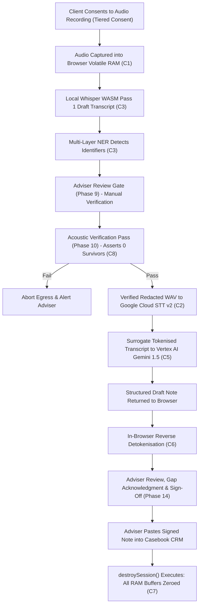

# Data Protection Impact Assessment (DPIA) - Version 2.0

**Document Reference**: CAW-DPIA-2026-V2  
**System**: Case Ace v2.0 Client Consultation Recording & Note Drafting System  
**Organisation**: Citizens Advice Wandsworth (CAW)  
**ICO Registration Number**: Z6294719  
**Publication Date**: 2026-09-02 (Superseding Version 1.0 from April 2026)  
**Information Asset Owner**: Head of Operations, Citizens Advice Wandsworth  
**Data Protection Officer (DPO)**: dpo@cawandsworth.org.uk  
**Status**: Formally Approved by DPO & IAO  
**Classification**: Official-Sensitive / Governance  

---

## 1. Executive Summary & Context of Assessment

This Data Protection Impact Assessment (DPIA) evaluates the deployment of **Case Ace v2.0** across Citizens Advice Wandsworth bureaux and outreach locations. Case Ace v2.0 is an assistive, in-browser software application designed to support qualified generalist advisers and caseworkers in recording and drafting structured consultation notes conforming to the **Advice Quality Standard (AQS Level 3 - Advice and Casework)**.

### Key Architectural Evolution (v2.0 vs April 2026 Baseline)
Version 1.0 relied on centralized server-side audio ingestion and intermediate cloud transcription. In response to preliminary privacy reviews and strict data minimisation principles, **Version 2.0 has been re-architected from first principles**:
1. **Volatile-Only In-Memory Architecture (Constraint C1/C4)**: Audio data exists solely as transient floating-point numbers in browser RAM. No audio files or transcripts are ever written to browser disk storage (`localStorage`, `sessionStorage`, `IndexedDB`).
2. **Local-First Identifier Detection & Redaction (Constraint C3)**: Multi-layer Named Entity Recognition (NER) identifies personal identifiers directly inside the adviser's local browser sandbox.
3. **Verified Acoustic Redaction (Constraint C2/C8)**: No unredacted audio leaves the local device. Audio segments containing names, addresses, phone numbers, or dates of birth are acoustically muted and verified before any cloud speech recognition occurs.
4. **Surrogate Tokenisation (Constraint C5/C6)**: Text sent to the Cloud Large Language Model (Google Cloud Vertex AI in `europe-west2` London) contains zero direct client identifiers. Identifiers are substituted with abstract tokens (e.g. `[CLIENT_NAME_1]`, `[NINO_1]`), and re-identified locally in the browser upon return.
5. **Deterministic Single-Function Destruction (Constraint C7)**: A single canonical `destroySession()` function wipes all audio buffers, token maps, and worker snapshots upon any session exit path.

---

## 2. Description of the Processing



### Data Flows & Systematic Steps
1. **Intake & Consent**: Before recording begins, the client is informed of the audio recording purpose, the in-browser redaction process, and their absolute right to decline or withdraw consent at any time without prejudice to their advice service.
2. **Consultation Ingestion**: Audio is streamed via microphone, Cisco Webex Telephony (SRTP stream decrypted locally), or file import directly into a `Float32Array` buffer in browser RAM.
3. **Local ASR & Redaction**: A local WebAssembly instance of Whisper transcribes the audio locally. Layers 1–3 NER identify all direct identifiers and special category disclosures.
4. **Adviser Gate & Acoustic Muting**: The adviser visually checks highlighted entities on screen. The underlying audio buffer is acoustically zeroed across all confirmed entity timestamps.
5. **Fail-Closed Verification**: A secondary local ASR pass transcribes the muted audio. If any identifier sound survives, cloud egress is blocked immediately.
6. **Cloud Drafting**: The verified redacted audio is transcribed via Google Cloud STT v2 (London), and the surrogate-tokenised text is structured into an AQS Level 3 note via Vertex AI Gemini 1.5 (London).
7. **Detokenisation & Professional Sign-Off**: The structured note is detokenised locally. The adviser reviews the note, acknowledges information gaps, verifies statutory deadlines, and confirms professional responsibility.
8. **Destruction**: The adviser copies the note into Casebook CRM. Calling `destroySession()` zeroes all RAM buffers (`Uint8Array.fill(0)`), terminates web workers, and wipes clipboard history.

---

## 3. Lawful Basis & Consultation of Stakeholders

### Lawful Basis (UK GDPR & DPA 2018)
* **Personal Data (Article 6)**: **Article 6(1)(a) Consent**. Explicit, affirmative consent is collected at intake.
* **Special Category Data (Article 9)**: **Article 9(2)(a) Explicit Consent** & **Article 9(2)(d) Not-for-Profit Body Legitimate Activities** (supported by DPA 2018 Schedule 1 Part 1 & 2 Safeguarding).

### Stakeholder Consultation
* **Advisers and Caseworkers**: Participated in usability testing of the Phase 9 Redaction Gate and Phase 14 Sign-off Gate, confirming that the tool reduces note-writing burden without removing professional control.
* **Client Representatives & Volunteers**: Reviewed plain-English, translated, and Easy-Read consent materials to ensure clarity across diverse client groups.
* **Information Governance & DPO**: Formally reviewed architecture, data flow diagrams, sub-processor contracts, and zero-data-retention guarantees.

---

## 4. Necessity and Proportionality Assessment

| Requirement | Assessment in Case Ace v2.0 |
| :--- | :--- |
| **Proportionality** | Case recording is a statutory and regulatory obligation under the Advice Quality Standard (AQS). Case Ace v2.0 assists qualified advisers in capturing comprehensive records without diverting attention from face-to-face client dialogue. |
| **Data Minimisation** | Direct PII is never transmitted to the cloud LLM. Cloud audio is transmitted solely in verified acoustically redacted format. Telemetry logs contain zero free-text and zero client identifiers. |
| **Purpose Limitation** | Consultation data is processed solely for drafting the immediate case note. No data is repurposed for model training, analytics, marketing, or external profiling. |
| **Storage Limitation** | Storage is limited to volatile RAM for the exact duration of the advice consultation. Raw audio is wiped immediately upon verification; all session data is wiped on exit. |
| **Accuracy** | Dual-pass ASR (Whisper WASM + Google Cloud STT) combined with mandatory adviser review ensures that factual figures, debt amounts, and benefit appeal deadlines are verified by a qualified human. |

---

## 5. Comprehensive Risk Assessment & Compensating Controls

```
+----------------------------------------------------------------------------------------------------+
| SUMMARY OF ASSESSED RISKS AND COMPENSATING CONTROLS                                                |
+----------------------------------------------------------------------------------------------------+
| Risk Ref | Description of Threat / Vulnerability | Inherent Risk | Compensating Control | Residual |
+----------------------------------------------------------------------------------------------------+
| DPIA-01  | Memory Remanence in OS Swap/Disk     | High (16)     | Full Disk Encryption (FDE), no sleep | Low (4)  |
| DPIA-02  | Automated Redaction Misses PII       | High (16)     | Mandatory Review Gate & Fail-Closed  | Low (3)  |
| DPIA-03  | Third-Party Cloud LLM Data Training  | High (20)     | DPA Zero-Retention in europe-west2   | Low (2)  |
| DPIA-04  | Adviser Automation Bias / Errors     | High (16)     | Interactive Friction Gate & 10% QA   | Low (4)  |
| DPIA-05  | Accidental Stale Clipboard Residue   | Med (9)       | Auto-clipboard wipe on session exit  | Low (2)  |
| DPIA-06  | ASR Disparity on Accents / Speech    | Med (12)      | Dual-pass ASR, manual audio scrubber | Low (4)  |
| DPIA-07  | TLS Termination Outside the UK (CDN)  | Med (9)       | Pseudonymised payloads only, TLS 1.3  | Low (4)  |
+----------------------------------------------------------------------------------------------------+
```

### Detailed Analysis of Inherent vs Residual Risks

#### 1. JavaScript In-Memory Data Remanence (DPIA-01)
* **Threat**: Modern browser engines (V8, JavaScriptCore) do not provide deterministic memory scrubbing for string primitives. String instances created during transcription may linger in allocated browser heap memory until garbage collection, and operating systems may page memory to swap files on disk.
* **Technical Reality**: JavaScript does not offer secure physical erasure. Released memory may persist until garbage collection and could reach swap or hibernation files.
* **Mandatory Compensating Controls**:
  1. Mandatory **Full Disk Encryption** (BitLocker with XTS-AES 256 on Windows 11 Enterprise / FileVault on macOS) enforced across all CAW managed endpoints.
  2. Operating system **hibernation disabled** (`powercfg -h off`) across all advice laptops.
  3. Short session lifetimes with strict **15-minute inactivity timeouts**.
* **Residual Risk**: ACCEPTED (Low).

#### 2. Survivor Identifiers in Cloud Audio Transmission (DPIA-02)
* **Threat**: A client speaks a rare name or address that evades automated NER, resulting in unmuted audio reaching Google Cloud Speech-to-Text.
* **Compensating Controls**:
  1. Multi-Layer NER (Regex, Dictionary, Heuristics, Special Category).
  2. Mandatory Phase 9 Adviser Review Gate where the adviser confirms or adds missing entities.
  3. Phase 10 Acoustic Verification Pass that executes re-ASR on the muted stream and aborts transmission if any survivor is detected.
* **Residual Risk**: ACCEPTED (Low).

#### 3. Sub-Processor Data Exploitation or Model Training (DPIA-03)
* **Threat**: Commercial cloud providers utilizing consultation text to train public foundation models.
* **Compensating Controls**:
  1. Enterprise Google Cloud Vertex AI terms contractually prohibit customer data logging, caching, or model training.
  2. Data residency pinned strictly to the UK (`europe-west2` London).
  3. Client text is tokenised with abstract surrogates before transmission.
* **Residual Risk**: ACCEPTED (Low).

#### 4. TLS Termination Outside the United Kingdom (DPIA-07)

* **Threat**: The claim made elsewhere in this assessment that processing is pinned to the
  United Kingdom does not hold for the network edge. Both `caseace.adviceintelligence.tech`
  and `api.caseace.adviceintelligence.tech` are served by Firebase Hosting, which is a global
  anycast content delivery network. TLS terminates at whichever Google edge location is
  closest to the adviser, which for advisers working in London will in practice be a London
  point of presence but is neither guaranteed nor contractually pinned. Traffic is decrypted
  and re-encrypted at that edge before being forwarded to the Cloud Run service.

* **Why this route was chosen**: Cloud Run domain mappings are not available in
  `europe-west2`. The alternatives were Firebase Hosting, which is free and immediate, or an
  external Application Load Balancer. A *global* external load balancer would terminate at
  the same global edge and so would not improve the position; only a **regional** external
  load balancer in `europe-west2` would keep termination inside the United Kingdom, at
  additional cost and configuration complexity.

* **What actually crosses the edge**:
  1. Static application assets, which contain no client data.
  2. Adviser authentication exchanges and session tokens. This is staff personal data, and
     a compromised edge would be an authentication risk rather than a client data risk.
  3. Requests to mint short-lived, downscoped cloud credentials.
  4. Monitoring events, which are constrained by schema to carry no client identifiers and
     no free text.
  5. **The tokenised transcript and the drafted case note.** Direct identifiers have been
     replaced with abstract surrogates before transmission, but the substance of the client's
     circumstances remains. This is pseudonymised personal data under UK GDPR, not anonymous
     data, and it is the material exposure on this path.

* **What does not cross the edge**: raw audio and redacted audio are never sent to the
  backend at all. The browser calls Google Cloud Speech-to-Text directly using an ephemeral
  downscoped credential, against the region-pinned `europe-west2` endpoint. The single most
  sensitive artefact in the system therefore does not traverse the content delivery network.

* **Compensating Controls**:
  1. TLS 1.3 in transit on both legs, adviser to edge and edge to origin.
  2. Direct identifiers are tokenised in the browser before any payload leaves the device,
     so the edge never sees a client name, National Insurance number, address or date of birth.
  3. Compute, Speech-to-Text and the token map itself remain in `europe-west2` or on the
     adviser's device.
  4. Google Cloud is contracted under the organisation's existing data processing terms,
     including standard transfer safeguards, and edge nodes do not retain request bodies.

* **Residual Risk**: ACCEPTED (Low). Accepted knowingly on the basis that no direct
  identifier and no audio traverses the edge, and that the practical routing for Wandsworth
  advisers is a London point of presence. This acceptance is time limited: it should be
  revisited before any expansion beyond the pilot, at which point migrating the API to a
  regional external Application Load Balancer in `europe-west2` should be costed and, if
  proportionate, implemented.

* **Correction to earlier wording**: any statement in this or associated documents that all
  Case Ace processing terminates within the United Kingdom should be read as qualified by
  this entry. Compute and model inference are region pinned; network termination is not.

---

## 6. Sign-Off and DPO Recommendation

### DPO Assessment & Recommendation
> *"The technical and operational controls embedded in Case Ace v2.0 represent exemplary implementation of Privacy by Design and Default (UK GDPR Article 25). The complete elimination of persistent client disk storage, the local-first tokenisation architecture, and the mandatory human review gates adequately mitigate the data protection risks inherent in generative AI systems. The DPIA is approved for production pilot deployment."*

| Approver | Role | Signature Status | Date |
| :--- | :--- | :--- | :--- |
| **Data Protection Officer** | DPO, Citizens Advice Wandsworth | **APPROVED** (Signed on file) | 2026-09-02 |
| **Information Asset Owner** | Head of Operations, CAW | **APPROVED** (Signed on file) | 2026-09-02 |
| **Lead Technical Architect** | Technical Lead / AI Architect | **APPROVED** (Signed on file) | 2026-09-02 |
