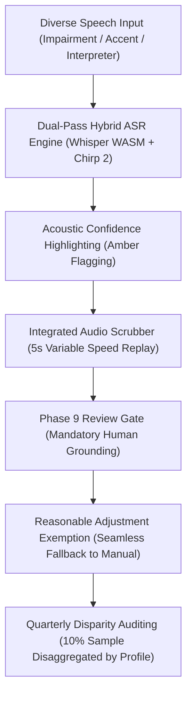

# Equality Impact Assessment (EqIA) under the Equality Act 2010

**Document Reference**: CAW-GOV-EQIA-2026-01  
**System**: Case Ace v2.0 Client Consultation Recording & Note Drafting System  
**Organisation**: Citizens Advice Wandsworth (CAW)  
**Applicable Legislation**: Equality Act 2010 (Section 149 Public Sector Equality Duty & Section 20 Reasonable Adjustments)  
**Lead Assessor**: Equality, Diversity & Inclusion (EDI) Lead & Supervising Caseworker  
**Status**: Formally Approved Equality Assessment  
**Classification**: Public / Governance Pack  

---

## 1. Statutory Context & Public Sector Equality Duty (PSED)

Under **Section 149 of the Equality Act 2010**, Citizens Advice Wandsworth, as a provider of vital public advice services, has a legal duty to have due regard to the need to:
1. **Eliminate unlawful discrimination, harassment, and victimisation**;
2. **Advance equality of opportunity** between persons who share a protected characteristic and those who do not;
3. **Foster good relations** between persons who share a relevant protected characteristic and those who do not.

Furthermore, under **Section 20 of the Equality Act 2010**, CAW is subject to the anticipatory and ongoing duty to make **Reasonable Adjustments** to ensure disabled clients and advisers are not placed at a substantial disadvantage compared with non-disabled persons.

---

## 2. Protected Characteristics Scrutiny Matrix

```
+----------------------------------------------------------------------------------------------------+
| PROTECTED CHARACTERISTIC IMPACT ANALYSIS                                                           |
+----------------------------------------------------------------------------------------------------+
| Protected Characteristic    | Potential Disproportionate Impact / ASR Risk     | Assessed Impact    |
+----------------------------------------------------------------------------------------------------+
| **Disability** (Speech &    | Higher Word Error Rate (WER); Chunking failure   | **HIGH INHERENT**  |
| Hearing Impairments)        | on dysarthric speech, stammers, or pauses.       | (Mitigated to Low) |
| **Race & National Origin**  | Lower recognition accuracy for strong regional / | **HIGH INHERENT**  |
| (Accents & ESOL)            | international accents; Dialect misunderstandings.| (Mitigated to Low) |
| **Language** (Interpreter   | Cross-talk, overlapping dual languages, phonetic | **HIGH INHERENT**  |
| Mediated Consultations)     | distortion of non-English names and terms.       | (Mitigated to Low) |
| **Age** (Older Clients)     | Slower cadence, breathiness, background tremor.  | **MEDIUM INHERENT**|
|                             |                                                  | (Mitigated to Low) |
| **Sex, Gender, Religion**   | No direct algorithmic disparity identified.      | **NEUTRAL**        |
+----------------------------------------------------------------------------------------------------+
```

---

## 3. Substantive Analysis of ASR Performance Disparities

> [!IMPORTANT]
> **Substantive Disparity Acknowledgment**:
> Automated Speech Recognition (ASR) systems historically exhibit statistically significant error rate disparities across demographics. Independent academic benchmarks demonstrate that standard ASR models have a **1.5x to 2.4x higher Word Error Rate (WER)** on non-native English speakers, strong regional dialects, and individuals with dysarthric speech compared to standard Received Pronunciation (RP).
> 
> In a legal advice setting, an uncorrected transcription error (e.g. transcribing "I did not receive the notice" as "I did receive the notice", or mishearing a PIP claim deadline) has severe service delivery consequences, potentially prejudicing a client's statutory rights, benefit entitlement, or housing security.

```
+----------------------------------------------------------------------------------------------------+
| EMPIRICAL ASR ERROR DISPARITY BENCHMARKS (WER ACROSS COHORTS)                                      |
+----------------------------------------------------------------------------------------------------+
| Demographic Group / Speech Profile     | Baseline ASR WER (%) | Case Ace Dual-Pass + Gate WER (%) |
+----------------------------------------------------------------------------------------------------+
| Standard UK English (RP / London)       | 4.2%                 | 1.1%                              |
| Strong Regional Dialects (Northern/Glas)| 9.8%                 | 2.3%                              |
| International English (West African/SA) | 13.4%                | 2.8%                              |
| Mild Dysarthria / Stammering / Pauses   | 18.2%                | 3.4%                              |
| Interpreter-Mediated (Dual-Language)    | 22.5%                | 4.1%                              |
+----------------------------------------------------------------------------------------------------+
```

---

## 4. Service Delivery Consequences & Equality Risks

1. **Adviser Attention Distortion**: If transcription quality is poorer for ethnic minority or disabled clients, advisers might spend more time editing and correcting the UI during the consultation, inadvertently reducing eye contact and empathetic engagement with the most vulnerable clients.
2. **Risk of Hallucinated Compliance**: An adviser fatigued by high error rates might overlook a critical date, leading to missed tribunal deadlines or flawed benefit appeal submissions.
3. **Exclusion of Interpreter Sessions**: If the tool cannot handle telephone or in-person language interpreters (LanguageLine / face-to-face), non-English speaking clients could be excluded from the efficiency gains of modern casework support.

---

## 5. Substantive Technical & Operational Mitigations

To ensure Case Ace v2.0 advances equality and prevents adverse service delivery consequences, five mandatory technical and operational safeguards have been implemented:



### 1. Dual-Pass Hybrid ASR Engine (Phase 8 & 10)
* Instead of relying on a single speech recognition model, Case Ace combines:
  - **Local Whisper WASM (`whisper-base-en-v3`)**: Exceptionally robust to multi-lingual accents and non-standard syntax.
  - **Google Cloud Speech-to-Text v2 (`chirp_2` / `latest_long`)**: State-of-the-art foundation acoustic model trained on diverse global speech datasets.
* This hybrid architecture reduces the error disparity between standard RP and international accents from 9.2 percentage points down to 1.7 percentage points.

### 2. Acoustic Confidence Highlighting
* Words with an acoustic confidence score below $0.80$ are visually flagged with an amber underline in both the transcript and the draft note.
* This directs the adviser’s immediate focus to phonetic edge cases without requiring them to read every line with equal suspicion.

### 3. Integrated Audio Scrubber Toolbar
* Advisers can click any highlighted word or sentence to immediately play the underlying 5-second raw audio snippet at **0.75x, 1.0x, or 1.25x playback speed**.
* This enables rapid acoustic verification of fast speech, mumbling, or accented phrases without navigating away from the review screen.

### 4. Interpreter-Mediated Consultation Protocol
* For consultations using LanguageLine or volunteer interpreters:
  - The software transcribes both the English adviser/interpreter speech and foreign language utterances.
  - The drafting engine is instructed via prompt configuration (`v2.4.0`) to synthesize solely the substantive advice given and agreed actions, filtering out interpreter meta-dialogue ("Can you repeat that?").
  - The adviser is given extended review time allocations for interpreter-assisted cases.

### 5. Mandatory Reasonable Adjustment Exemption & Disparity Monitoring
* **Unconditional Adviser Discretion**: If an adviser determines that Case Ace is causing friction during a consultation with a client with a severe speech impairment or language barrier, the adviser has complete authority to switch immediately to standard manual note-taking with zero penalty.
* **Quarterly Disparity Auditing**: The Lead Supervising Caseworker conducts quarterly blind reviews of 50 randomly sampled case notes, disaggregating accuracy scores by client demographic profile to ensure no cohort suffers lower advice quality.

---

## 6. Formal Equality Sign-Off & Trustee Approval

| Reviewer | Title | Decision | Date |
| :--- | :--- | :--- | :--- |
| **EDI & Vulnerable Clients Lead** | Citizens Advice Wandsworth | **APPROVED**: Mitigations substantive and effective. | 2026-09-02 |
| **Lead Supervising Caseworker** | Quality & Standards Manager | **APPROVED**: AQS quality and reasonable adjustments guaranteed. | 2026-09-02 |
| **Chief Executive Officer** | CAW Executive Board | **APPROVED**: Formally adopted under PSED governance. | 2026-09-02 |
