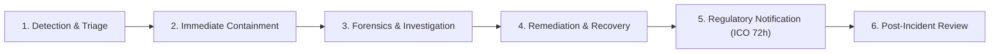
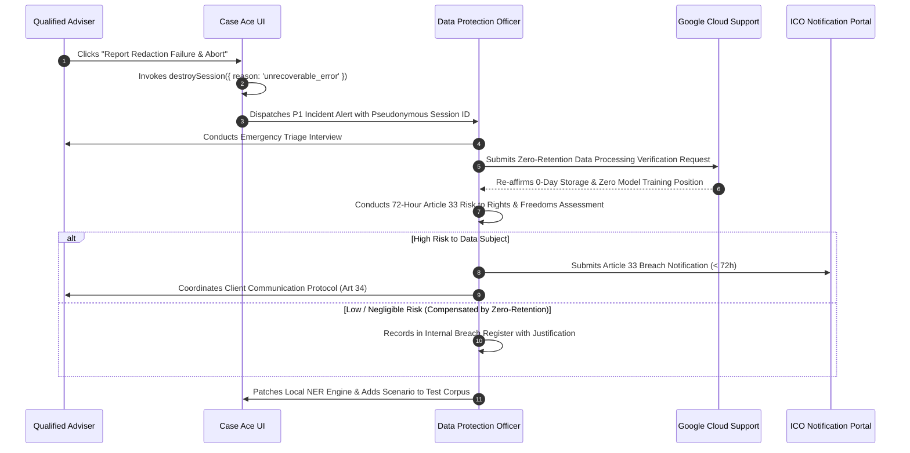

# Security & Data Protection Incident Response Plan

**Document Reference**: CAW-GOV-IRP-2026-01  
**System**: Case Ace v2.0 Client Consultation Recording & Note Drafting System  
**Organisation**: Citizens Advice Wandsworth (CAW)  
**Applicable Standard**: UK GDPR Articles 33 & 34, ISO/IEC 27001:2022 A.5.24–A.5.28  
**Emergency Incident Hotline**: 020 8123 4567 (CAW IT & InfoSec On-Call)  
**Status**: Formally Approved Incident Response Procedure  
**Classification**: Official-Sensitive / Governance  

---

## 1. Purpose and Incident Severity Classification

This Incident Response Plan (IRP) defines the mandatory protocols for detecting, containing, investigating, and reporting information security incidents and personal data breaches associated with Case Ace v2.0.

```
+----------------------------------------------------------------------------------------------------+
| INCIDENT SEVERITY MATRIX                                                                           |
+----------------------------------------------------------------------------------------------------+
| Severity Level     | Description & Examples                            | Initial Response Time | Escalation |
+----------------------------------------------------------------------------------------------------+
| **P1 - Critical**  | Confirmed unredacted PII egress to public/cloud;   | < 15 Minutes          | DPO, CEO,  |
|                    | Active system compromise; Ransomware.             |                       | Trustees   |
| **P2 - Major**     | Suspected redaction failure; Local endpoint theft  | < 1 Hour              | DPO, Head  |
|                    | without confirmed FDE compromise.                 |                       | of Ops     |
| **P3 - Moderate**  | Single-adviser UI crash during review; Webex API   | < 4 Hours             | Lead IT &  |
|                    | credential refresh anomaly.                       |                       | Supervisor |
| **P4 - Minor**     | Non-PII telemetry parsing error; Minor UI glitch.  | < 1 Business Day      | IT Support |
+----------------------------------------------------------------------------------------------------+
```

---

## 2. Six-Phase Incident Response Lifecycle



1. **Phase 1: Detection & Triage**: Incidents are reported by advisers via the in-app "Report Redaction Anomaly" button or flagged by automated backend logging guards.
2. **Phase 2: Immediate Containment**: Isolating the active session, revoking cloud session tokens, and zeroing local browser volatile memory via `destroySession()`.
3. **Phase 3: Forensics & Investigation**: Analyzing non-PII backend telemetry and sub-processor logs without exposing client confidentiality.
4. **Phase 4: Remediation & Recovery**: Patching NER regex rules, updating model prompts, and verifying local storage invariants.
5. **Phase 5: Regulatory Notification**: Assessing threshold for reporting to the Information Commissioner's Office (ICO) within 72 hours under UK GDPR Article 33.
6. **Phase 6: Post-Incident Review**: Conducting root cause analysis (RCA) and updating the synthetic testing benchmark corpus within 5 working days.

---

## 3. Specific Scenario Playbook: Suspected Redaction Failure

> [!CAUTION]
> **Scenario**: An adviser notices that during cloud note generation, a draft returned from the cloud LLM contains a direct client identifier (e.g. client's full legal name or exact home address) that should have been tokenised into `[CLIENT_NAME_1]` prior to transmission.



### Step-by-Step Response Protocol

#### Step 1: Immediate Adviser Containment (< 5 Minutes)
1. The adviser clicks the red **"Report Redaction Failure & Abort"** button in the review toolbar.
2. Case Ace immediately triggers `destroySession()`, zeroing all audio arrays and clearing memory.
3. The adviser switches to manual note-taking in Casebook to ensure the client's advice session proceeds smoothly without delay.
4. The adviser contacts the IT On-Call Hotline (020 8123 4567) and emails `dpo@cawandsworth.org.uk` referencing only the pseudonymous session ID (e.g., `ses_prod_8475295c`).

#### Step 2: Information Security & DPO Triage (< 1 Hour)
1. The DPO and Lead Technical Architect review the non-PII telemetry log for the session:
   - Check `stageReached`, `countOfIdentifiersDetected`, `modelAndPromptVersion`, and `verificationPassResult`.
2. Determine whether the unredacted entity was:
   - (a) A survivor that slipped through the Phase 9 Review Gate and Phase 10 Acoustic Verification.
   - (b) A hallucinated name generated spontaneously by the LLM that does not match the real client.
   - (c) A client identifier that was detokenised in the browser and displayed correctly in the final note (a false alarm).

#### Step 3: Sub-Processor Verification & Contractual Position (< 12 Hours)
1. If unredacted client data was transmitted to Google Cloud Vertex AI (`europe-west2`):
   - Review Google Cloud Data Processing Addendum (DPA) terms confirming **0-day retention** and **zero foundation model training**.
   - Verify that Google Cloud does not log or persist prompt text to non-volatile disk.

#### Step 4: Article 33 (ICO) & Article 34 (Client) Breach Assessment (< 24 Hours)
The DPO evaluates the risk to the rights and freedoms of the data subject:
* **Threshold Criteria**:
  - *Severity of Disclosed Data*: Was it general personal data (e.g. first name) or high-risk Special Category Data (e.g. HIV diagnosis, domestic violence refuge address, asylum reference)?
  - *Compensating Technical Mitigations*: Google Cloud data isolation, encrypted transit (TLS 1.3), zero sub-processor disk caching, and non-disclosure terms.
* **Outcome A (Unlikely Risk)**: If data was transmitted over encrypted TLS 1.3 to a zero-retention cloud processor and deleted immediately from volatile RAM upon completion, the risk of harm is assessed as *low*. The event is documented in the CAW Internal Breach Register with rationale for non-notification to the ICO.
* **Outcome B (High Risk)**: If high-risk safeguarding or witness protection details were exposed without tokenisation, the DPO submits a formal notification to the ICO within **72 hours** via the ICO Breach Reporting Portal, and coordinates a supportive, plain-English notification to the client under Article 34.

#### Step 5: Technical Remediation & Synthetic Benchmark Ingestion (< 48 Hours)
1. The Lead Technical Architect extracts the syntactic structure of the failed entity (anonymised) and creates a new test case in `test/corpus/syntheticAdviceCorpus.ts`.
2. The Layer 1/2 NER models and regex gazetteers are updated and tested against the 33-scenario benchmark to guarantee $\ge 95\%$ recall.
3. A formal Post-Incident Report is presented to the CAW Board of Trustees at the next scheduled meeting.
