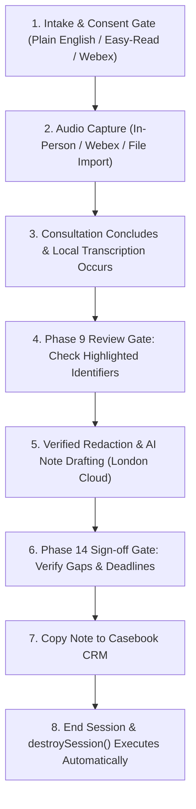

# Adviser Standard Operating Procedure (SOP)

**Document Reference**: CAW-SOP-ADV-2026-01  
**System**: Case Ace v2.0 Client Consultation Recording & Note Drafting System  
**Organisation**: Citizens Advice Wandsworth (CAW)  
**Target Audience**: Qualified Generalist Advisers, Caseworkers, and Volunteer Trainees  
**Effective Date**: 2026-09-02  
**Status**: Formally Approved Operating Procedure  
**Classification**: Internal / Operational  

---

## 1. Introduction and Core Adviser Responsibilities

Case Ace v2.0 is an assistive, privacy-preserving consultation recording and case note drafting application. It is designed to assist you in producing comprehensive, structured consultation notes that meet the **Advice Quality Standard (AQS Level 3)** while allowing you to maintain full eye contact and active listening with your client.

> [!IMPORTANT]
> **Fundamental Professional Principle**:
> Case Ace is an assistive drafting tool, **not an automated decision-maker**. 
> As the qualified adviser, you retain **sole legal, ethical, and professional responsibility** for every word, figure, and advice summary pasted into Casebook CRM. You must personally review, verify, and sign off every case note.

---

## 2. Step-by-Step Consultation Workflow



### Step 1: Intake & Obtaining Client Consent
1. Introduce the tool using the approved **Client Consent Script** (see [`docs/operational/client-consent-scripts.md`](./client-consent-scripts.md)).
2. Explain clearly:
   - Recording is voluntary. Choosing not to record has zero impact on their advice or appointment.
   - Names, dates of birth, and addresses are automatically muted on the computer before note generation.
   - The recording is deleted immediately once the note is written.
3. If the client agrees, select the corresponding intake route in the UI and click **"Confirm Client Consent & Start Session"**.

---

### Step 2: Ingestion Across the Three Intake Routes

#### Route A: Live In-Person Consultation
1. Position the bureau microphone equidistant between you and the client.
2. Click **"Start In-Person Recording"** in Case Ace.
3. Conduct the advice interview normally.
4. If the client asks to pause or stop, click **"Pause Recording"** or **"Withdraw Consent"** immediately.

#### Route B: Cisco Webex Telephony Consultation
1. Answer or initiate the call in your Cisco Webex softphone application.
2. Inform the telephone client using the **Telephone Webex Consent Script**.
3. In Case Ace, click **"Connect Webex Call Stream"**. The application binds to the active Webex call and begins in-memory streaming.
4. When the call ends, Case Ace automatically detects call hangup and begins transcription.

#### Route C: Importing Externally Captured Recordings (Home Visits / Outreach)
*(See Section 3 below for full mandatory protocol).*

---

### Step 3: Phase 9 Identifier Review Gate
Once local transcription finishes (typically within 10–20 seconds):
1. The **Phase 9 Review Gate** appears on your screen displaying the draft transcript with detected personal identifiers highlighted in green (names, NINOs, addresses, phone numbers, health terms).
2. **Scan the transcript**:
   - If an identifier was missed (e.g. an unusual nickname or foreign reference number), highlight the word with your cursor and click **"Redact As Identifier"**.
   - If a non-identifying word was mistakenly tagged, click it and select **"Remove Redaction"**.
3. Click **"Approve Redactions & Generate Note"**.
4. Case Ace immediately performs an acoustic verification pass, mutes the audio stream across those timestamps, and generates the structured draft note.

---

### Step 4: Phase 14 Review, Gap Acknowledgment & Professional Sign-Off
When the draft note appears:
1. **Examine Structure**: Verify that the note contains:
   - *Confirmation of Enquiry* (Client circumstances and reasons for seeking advice).
   - *Advice Given* (Options explained, statutory rights, and benefit calculations).
   - *Agreed Action Plan* (Itemized tasks with explicit deadlines for both client and bureau).
2. **Acknowledge Information Gaps**:
   - If the client did not state essential information (e.g. tenancy start date, exact arrears figure, or award end date), Case Ace highlights these as **Unverified Gaps**.
   - You must review and check off each gap individually to confirm whether you have verified it offline or whether it remains an outstanding action item.
3. **Interactive Highlighting**: Click any sentence in the draft note to instantly inspect the corresponding transcript passage and replay the underlying audio snippet.
4. **Affirmative Sign-Off**:
   - Check the affirmation box: *"I confirm that I have personally verified this advice note and take full professional responsibility for its accuracy."*
   - Click **"Copy Signed Note to Clipboard"**.

---

### Step 5: Transfer to Casebook & Session Destruction
1. Switch to your open **Casebook CRM** window.
2. Paste the signed note (`Ctrl+V` or `Cmd+V`) into the appropriate Case Activity record and save the case.
3. Return to Case Ace and click **"End Session & Wipe Data"**.
4. Case Ace runs `destroySession()`, zeroing all audio buffers in RAM, clearing transcripts, terminating background workers, and clearing the clipboard.

---

## 3. Mandatory Protocol: Importing Externally Captured Recordings

> [!CAUTION]
> **Source File Retention & Disposal Rules**:
> When recording outreach, home visits, or prison advice sessions using standalone hardware (e.g. Olympus/Sony dictaphones or CAW-managed smartphones), you are responsible for the physical custody and immediate deletion of the source audio file.

```
+----------------------------------------------------------------------------------------------------+
| EXTERNAL IMPORT LIFECYCLE & DELETION TIMELINE                                                      |
+----------------------------------------------------------------------------------------------------+
| Action                                  | Storage Medium          | Permitted Retention Period     |
+----------------------------------------------------------------------------------------------------+
| 1. Record consultation in field         | Hardware Dictaphone/SD  | Max 24 hours (Transit to desk) |
| 2. Connect device to CAW managed laptop | USB Cable               | Transient mount                |
| 3. Import file into Case Ace UI         | Browser Volatile RAM    | In-memory processing           |
| 4. Video track discarded (if MP4/MOV)   | Memory Buffer           | Instant purge                  |
| 5. Note signed off & saved to Casebook  | Casebook CRM            | 6 Years (Casework Record)      |
| 6. Delete file from Dictaphone & Laptop | Disk / SD Card          | **IMMEDIATE (Within 5 Mins)**  |
+----------------------------------------------------------------------------------------------------+
```

### Step-by-Step Import & Deletion Procedure:
1. **Connect Device**: Plug the approved dictaphone into your CAW-managed laptop.
2. **Select Import File**: In Case Ace, select **"Import External Recording"** and choose the audio/video file (`.wav`, `.mp3`, `.m4a`, `.aac`, `.mp4`).
3. **Verify Video Track Discard**: If you upload a video file, Case Ace automatically strips and discards the video track, retaining solely the mono audio channel in RAM.
4. **Process Note**: Complete the Phase 9 Redaction Gate, review the draft note, and paste it into Casebook CRM.
5. **Immediate Mandatory Physical Deletion**:
   - Open File Explorer / Finder on your laptop.
   - Delete the source recording file from your dictaphone / SD card.
   - If the file was copied to your laptop `Downloads/` or `Temp/` folder, delete it immediately using **Permanent Delete** (`Shift+Delete` on Windows / `Option+Cmd+Delete` on Mac) and empty your Recycle Bin / Trash.
   - Unplug the dictaphone.
6. **Audit Affirmation**: When ending the session in Case Ace, check the box: *"I confirm that all local source audio files have been permanently deleted from this computer and external media."*
