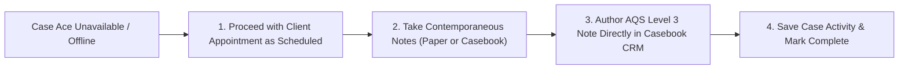

# Business Continuity & Fallback Procedure

**Document Reference**: CAW-SOP-BCP-2026-01  
**System**: Case Ace v2.0 Client Consultation Recording & Note Drafting System  
**Organisation**: Citizens Advice Wandsworth (CAW)  
**Target Audience**: All Advisers, Caseworkers, Supervisors, and Bureau Managers  
**Status**: Formally Approved Business Continuity Procedure  
**Classification**: Internal / Operational  

---

## 1. Core Principle: Zero Operational Dependency

> [!IMPORTANT]
> **The Baseline Principle of Business Continuity**:
> Case Ace v2.0 is an assistive productivity tool, **NOT a mission-critical operating system or core dependency**. 
> 
> When Case Ace is unavailable for any reason (cloud outage, network failure, software bug, or local device issue), **the business continuity procedure is simply the existing, standard operational practice of Citizens Advice Wandsworth**: advisers take notes by hand on paper or type them directly into Casebook CRM during and immediately following the consultation. 
> 
> **Client appointments must NEVER be cancelled, postponed, or delayed due to Case Ace unavailability.**

---

## 2. Trigger Events for Business Continuity Activation

The standard manual note-taking procedure is activated immediately upon any of the following events:

```
+----------------------------------------------------------------------------------------------------+
| BUSINESS CONTINUITY TRIGGER MATRIX                                                                 |
+----------------------------------------------------------------------------------------------------+
| Trigger Event                     | Technical Indicator / Symptom               | Fallback Action  |
+----------------------------------------------------------------------------------------------------+
| **Cloud Provider Outage**         | Google Cloud STT or Vertex AI unreachable   | Revert to Manual |
| **Local Bureau Internet Failure** | Bureau broadband / WiFi offline             | Revert to Manual |
| **Local Browser Crash / Bug**     | Application frozen or fails to load WASM    | Revert to Manual |
| **Webex Telephony API Failure**   | Softphone audio stream uncapturable         | Revert to Manual |
| **Client Expresses Reluctance**   | Client declines audio recording             | Revert to Manual |
+----------------------------------------------------------------------------------------------------+
```

---

## 3. The Standard Manual Operating Procedure (The Fallback Process)

When Case Ace is unavailable or bypassed:



### Step-by-Step Manual Process:
1. **Proceed with Appointment**: Welcome the client and begin the advice interview without mentioning system technicalities.
2. **Contemporaneous Note-Taking**:
   - Write contemporaneous notes on an approved CAW paper consultation notepad or type directly into an open Case Activity draft in Casebook CRM.
   - Capture key dates, debt amounts, benefit references, and household circumstances.
3. **Drafting and Case Recording**:
   - Structure the note using standard AQS Level 3 headings: *Confirmation of Enquiry*, *Advice Given*, and *Agreed Action Plan*.
   - Ensure all statutory deadlines (e.g. 1-month Mandatory Reconsideration windows, court hearing dates) are explicitly recorded.
4. **Disposal of Paper Notes**:
   - If handwritten notes were taken on paper, transfer them into Casebook CRM.
   - Once verified in Casebook, immediately place the paper consultation notes into the confidential shredding console.

---

## 4. Technical Recovery and Resumption Protocol

```
+----------------------------------------------------------------------------------------------------+
| TECHNICAL RECOVERY WORKFLOW                                                                        |
+----------------------------------------------------------------------------------------------------+
| Step | Action Taken by IT Support Team                              | Communication Channel        |
+----------------------------------------------------------------------------------------------------+
| 1.   | Verify status of Google Cloud Vertex AI / STT in europe-west2| Google Cloud Status Dashboard|
| 2.   | Restart backend API container / Nginx reverse proxy if needed| Internal Service Monitoring  |
| 3.   | Run automated health checks & smoke tests                   | `npm run test:prod-health`   |
| 4.   | Broadcast "Service Restored" notice to bureau staff          | Internal Teams / Staff Email |
| 5.   | Advisers may resume using Case Ace for subsequent sessions   | Standard SOP Resumed         |
+----------------------------------------------------------------------------------------------------+
```

* **No Backlog or Data Sync Needed**: Because Case Ace operates strictly in volatile RAM with zero persistent database records or server-side queues, an outage creates **zero backlogged data to reconcile or recover**. Once the service is online, new sessions begin cleanly.
