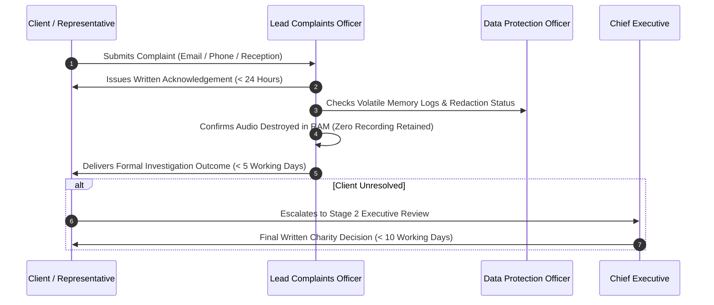

# Client Complaints Procedure (Consultation Audio Recording & AI Assistance)

**Document Reference**: CAW-SOP-CMP-2026-01  
**System**: Case Ace v2.0 Client Consultation Recording & Note Drafting System  
**Organisation**: Citizens Advice Wandsworth (CAW)  
**Target Audience**: Clients, Bureau Reception Staff, Advisers, and Complaints Investigators  
**Effective Date**: 2026-09-02  
**Status**: Formally Approved & Published Operating Procedure  
**Classification**: Public / Client-Facing  

---

## 1. Policy Statement & Commitment to Fair Advice

Citizens Advice Wandsworth is committed to providing free, confidential, impartial, and independent advice of the highest standard. We recognize that recording consultation audio—even for assistive note-taking—requires complete transparency, voluntary consent, and an accessible grievance route.

> [!IMPORTANT]
> **Zero Retaliation Guarantee**:
> Making a complaint or expressing concern regarding consultation recording will **never adversely affect the quality, urgency, or availability of your advice or future appointments**.

---

## 2. Multi-Channel Contact & Ingestion Routes

Clients wishing to raise a question, objection, or formal complaint regarding the use of Case Ace recording may do so through any of the following staffed channels:

```
+----------------------------------------------------------------------------------------------------+
| CLIENT COMPLAINTS INGESTION CHANNELS                                                               |
+----------------------------------------------------------------------------------------------------+
| Ingestion Channel          | Contact Details / Location                 | Operating Hours          |
+----------------------------------------------------------------------------------------------------+
| **Direct In-Person**       | Speak with Reception or Duty Supervisor at | Monday – Friday          |
|                            | Battersea or Roehampton Bureau             | 09:30 – 16:30            |
| **Dedicated Email**        | `complaints@cawandsworth.org.uk`           | Monitored Daily (24h SLA)|
| **Direct Telephone Line**  | 020 8682 3766 (Ext. 2)                     | Monday – Friday          |
|                            | (Ask for Lead Complaints Officer)          | 10:00 – 16:00            |
| **Postal Mail**            | Client Feedback & Complaints Lead          | Standard Mail SLA        |
|                            | Citizens Advice Wandsworth                 |                          |
|                            | Battersea Library, 265 Lavender Hill,      |                          |
|                            | London SW11 1JB                            |                          |
+----------------------------------------------------------------------------------------------------+
```

---

## 3. Dedicated Staffing & Roles

* **Lead Client Complaints Officer**: Senior Operations Manager (Wandsworth Bureaux).
* **Data Protection Officer (DPO)**: Investigates any complaint involving suspected privacy breach or consent validity.
* **Lead Quality Manager**: Investigates complaints regarding advice accuracy or note content.

---

## 4. Response Timeframes & Investigation Workflow



### Stage 1: Frontline Resolution (< 24–48 Hours)
1. **Immediate Verification**: The Complaints Officer checks the pseudonymous session ID in the telemetry log to verify the stage reached and outcome.
2. **Privacy Reassurance**: The officer provides formal written confirmation that:
   - The consultation recording was processed strictly in temporary computer memory (RAM).
   - The audio was completely erased at session end (`destroySession()`).
   - No audio recording or unredacted personal information is stored on computer disks or shared with any third party.
3. **Formal Resolution Letter**: Delivered to the client within 5 working days.

### Stage 2: Executive Review (Chief Executive)
If the client is dissatisfied with the Stage 1 outcome, the complaint is escalated directly to the Chief Executive of Citizens Advice Wandsworth for a comprehensive review within 10 working days.

---

## 5. Independent External Escalation

If a client remains dissatisfied after exhausting CAW's internal complaints process, they have the statutory right to escalate their complaint to independent external bodies:

1. **Citizens Advice National Customer Services**:
   - Web: [citizensadvice.org.uk/about-us/contact-us/complaints](https://www.citizensadvice.org.uk)
   - Phone: 0300 023 1231
2. **Information Commissioner's Office (ICO)** (For Data Privacy Matters):
   - Wycliffe House, Water Lane, Wilmslow, Cheshire, SK9 5AF
   - Web: [ico.org.uk/make-a-complaint](https://ico.org.uk/make-a-complaint/)
   - Helpline: 0303 123 1113
3. **The Legal Ombudsman / Financial Ombudsman Service** (Where statutory advice applies).
