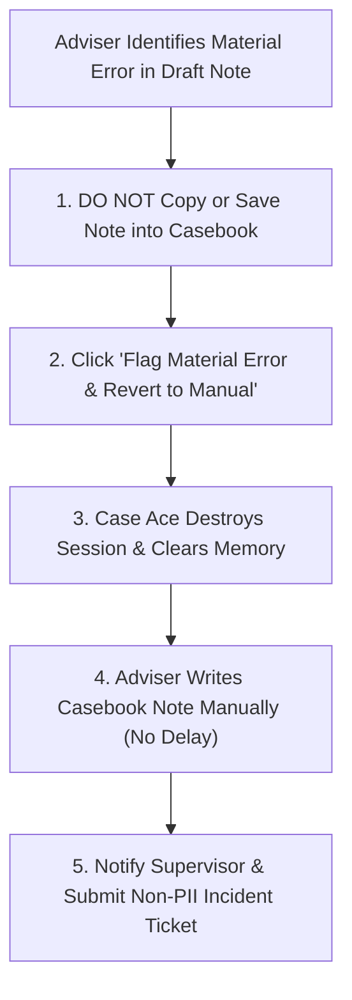
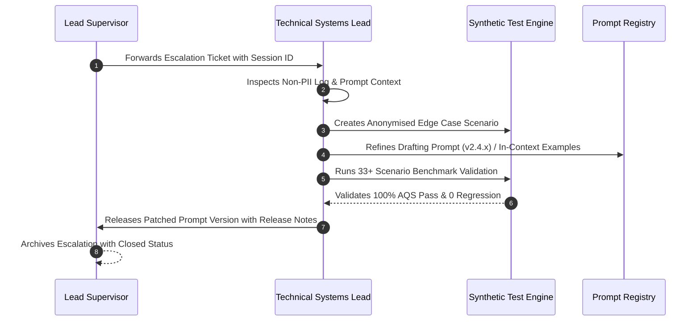

# Material Error Escalation Procedure

**Document Reference**: CAW-SOP-ESC-2026-01  
**System**: Case Ace v2.0 Client Consultation Recording & Note Drafting System  
**Organisation**: Citizens Advice Wandsworth (CAW)  
**Target Audience**: Qualified Advisers, Supervising Caseworkers, and AI System Administrators  
**Status**: Formally Approved Operational Procedure  
**Classification**: Internal / Operational  

---

## 1. Definition and Scope of a Material Error

A **Material Error** occurs when the AI-generated draft note produces a substantive factual, legal, or procedural statement that is inaccurate, contradictory to the consultation dialogue, or legally flawed, and which cannot be remedied by minor text edits.

```
+----------------------------------------------------------------------------------------------------+
| MATERIAL ERROR CLASSIFICATION GUIDE                                                                |
+----------------------------------------------------------------------------------------------------+
| Error Type                 | Concrete Consultation Example                                         | Severity |
+----------------------------------------------------------------------------------------------------+
| **Factual Inversion**      | Stating client is a private tenant when they are an owner-occupier.   | CRITICAL |
| **Hallucinated Rights**    | Inventing a nonexistent local authority grant or appeal right.        | CRITICAL |
| **Financial Distortion**   | Misstating rent arrears as £15,000 instead of £1,500.                  | CRITICAL |
| **Statutory Deadline Fail**| Setting a tribunal appeal deadline to 6 months instead of 1 month.    | CRITICAL |
| **Omitted Crucial Advice** | Completely omitting urgent Section 21 eviction defense advice given.  | HIGH     |
| **Minor Typo / Spelling**  | Misspelling a street name or minor grammatical slip.                 | LOW (Edit)|
+----------------------------------------------------------------------------------------------------+
```

---

## 2. Five-Step Immediate In-Session Escalation Protocol



### Step 1: Immediate Freeze (Zero Tolerance for Unverified Saves)
* **Rule**: Under no circumstances must a draft containing an uncorrected material error be pasted into Casebook CRM.

### Step 2: In-App Error Flagging
* Click the red **"Flag Material Error & Revert to Manual"** button in the top toolbar of the Phase 14 Sign-Off screen.
* A brief non-PII dialog will ask you to categorize the error type:
  - `[ ] Factual Inversion`
  - `[ ] Hallucinated Legal Right`
  - `[ ] Financial Calculation Error`
  - `[ ] Missed Critical Advice Section`
  - `[ ] Other (Describe without client PII)`

### Step 3: Automated Session Cleanup
* Case Ace logs a structured telemetry event (`MATERIAL_ERROR_FLAGGED`) with model and prompt versions.
* Case Ace automatically executes `destroySession()`, zeroing all audio buffers in RAM to ensure no data is orphaned.

### Step 4: Seamless Transition to Manual Casework
* Without interrupting your casework workflow or keeping the client waiting, immediately switch to Casebook CRM and author the consultation record manually using standard bureau procedures.

### Step 5: Supervisory Notification
* Send an internal email to `supervisors@cawandsworth.org.uk` and `ai-feedback@adviceintelligence.tech` containing:
  - The pseudonymous Session ID (displayed on screen, e.g. `ses_prod_8475295c`).
  - Error category selected.
  - A brief 1-sentence description of the discrepancy (e.g. *"Model stated Section 21 notice was valid despite missing gas safety certificate"*).
  - **IMPORTANT**: Do NOT include client names, telephone numbers, or case reference numbers in this technical feedback email.

---

## 3. Supervisory & Technical Root Cause Investigation



### Investigation Protocol (< 48 Hours):
1. **Log Analysis**: The Technical Systems Lead reviews the non-PII telemetry payload (`modelAndPromptVersion`, `wordCounts`, `verificationPassResult`).
2. **Failure Mode Diagnosis**:
   - *Was it an ASR transcription error?* (e.g., Speech-to-Text misheard "invalid" as "valid").
   - *Was it a prompt reasoning error?* (e.g., Gemini 1.5 failed to resolve conflicting tenancy dates).
   - *Was it context window truncation?*
3. **Synthetic Corpus Ingestion**: The anonymised scenario structure is converted into a synthetic test case in `test/corpus/syntheticAdviceCorpus.ts`.
4. **Prompt Patch & Regression Testing**:
   - The drafting prompt is updated (e.g. `v2.4.1`) with explicit guardrail rules preventing that specific error pattern.
   - The full automated regression test suite is run to ensure zero regressions across all 33 baseline advice scenarios.
5. **Closure Report**: A monthly summary of all escalated material errors is presented to the CAW Quality Committee.
