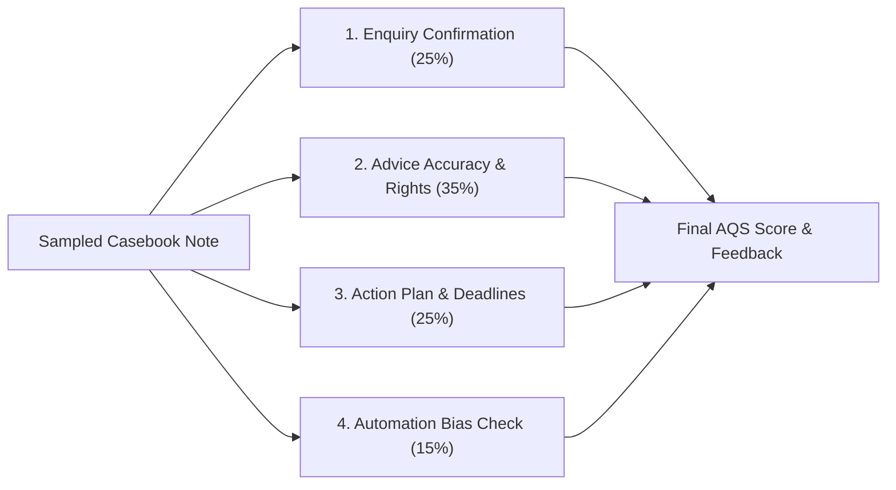

# Supervisor Quality Assurance Procedure for Case Ace Assisted Notes

**Document Reference**: CAW-SOP-SUP-2026-01  
**System**: Case Ace v2.0 Client Consultation Recording & Note Drafting System  
**Organisation**: Citizens Advice Wandsworth (CAW)  
**Target Audience**: Lead Supervising Advisers, Quality Managers, and Bureau Service Managers  
**Standard**: Advice Quality Standard (AQS Level 3 - Advice and Casework) & Citizens Advice Quality Framework  
**Status**: Formally Approved Quality Procedure  
**Classification**: Internal / Operational  

---

## 1. Purpose and Supervisory Scope

To maintain the highest standard of client care and uphold the **Advice Quality Standard (AQS Level 3)**, all case records drafted with the assistance of Case Ace v2.0 are subject to rigorous, independent supervisory audit.

This procedure sets out the mandatory sampling frequency, scoring criteria, automation bias checks, and corrective action workflows for supervising advisers.

---

## 2. Sampling Frequency and Selection Protocol

```
+----------------------------------------------------------------------------------------------------+
| SUPERVISORY SAMPLING FREQUENCY MATRIX                                                              |
+----------------------------------------------------------------------------------------------------+
| Adviser Experience Level               | Case Ace Experience / Stage    | Mandatory Sampling Rate   |
+----------------------------------------------------------------------------------------------------+
| **Trainee / Volunteer Adviser**        | All Stages                     | **100%** (Pre-Save Audit) |
| **Qualified Generalist (Pilot Stage)** | Weeks 1–2 of Case Ace Use      | **100%** (First 10 Cases) |
| **Qualified Generalist (Post-Pilot)**  | Steady-State Operation         | **10%** (Random Sample)   |
| **High-Risk Casework** (Debt/Housing)  | Eviction / Court Deadlines     | **25%** (Targeted Sample) |
+----------------------------------------------------------------------------------------------------+
```

### Random Selection Method
1. Every Friday, the Quality Manager extracts the weekly case activity export from Casebook CRM.
2. Filter for case notes tagged with `[CaseAce-Assisted: v2.0]`.
3. An automated script generates a random $10\%$ sample across all active generalist advisers.
4. The Lead Supervising Adviser audits each sampled case using the AQS Level 3 Scoring Sheet in Section 3.

---

## 3. AQS Level 3 Quality Audit Marking Scheme

Every sampled case note is scored across four core dimensions (Pass / Borderline / Fail):



### Scoring Dimensions

#### Dimension 1: Accurate Confirmation of Enquiry (25 Points)
* **Criteria**: Does the note clearly document the client’s presenting issue, background context, household composition, income/benefit status, and any vulnerability/safeguarding indicators?
* *Standard*: Complete, coherent, and free of generic fluff.

#### Dimension 2: Accuracy of Advice Given & Statutory Rights (35 Points)
* **Criteria**: Is the legal and regulatory advice completely accurate? Were all viable options (e.g. Mandatory Reconsideration, DRO, Section 21 defense) explained with their respective pros and cons?
* *Standard*: Zero factual errors; calculations (benefit rates, priority debt balances) exact.

#### Dimension 3: Action Plan, Deadlines & Clear Responsibilities (25 Points)
* **Criteria**: Does the note clearly distinguish between actions to be completed by the client vs actions to be undertaken by the bureau? Are all statutory deadlines (e.g. 1-month MR window, 14-day court response) recorded with exact calendar dates?
* *Standard*: Unambiguous task ownership and dated deadlines.

#### Dimension 4: Automation Bias & Human Oversight Verification (15 Points)
* **Criteria**: Did the adviser demonstrate genuine critical engagement with the AI draft?
  - Are specific client circumstances clearly reflected, or does the note read like generic boilerplate?
  - Were all unverified information gaps properly addressed rather than ignored?
  - Is the note appropriately tailored to the client's individual needs?

---

## 4. Automation Bias Detection Checklist

> [!CAUTION]
> **Warning Signs of Automation Bias (Adviser Review Fatigue)**:
> Supervising advisers must scrutinize notes for these specific failure modes:
> 1. **Vague Statutory References**: E.g. *"The client was advised about housing options"* without stating whether a Section 188 interim accommodation duty applies.
> 2. **Omitted Dollar/Pound Figures**: E.g. *"The client owes council tax"* without recording the exact liability order amount.
> 3. **Unchecked Information Gaps**: Leaving tenancy start dates or landlord notice types unspecified when they are critical to the advice outcome.
> 4. **Formulaic Action Plans**: E.g. *"Client to provide documents"* without listing which specific bank statements or wage slips are needed.

---

## 5. Non-Conformity Scoring & Corrective Action Plans

```
+----------------------------------------------------------------------------------------------------+
| SCORING OUTCOMES & ESCALATION PATHS                                                                |
+----------------------------------------------------------------------------------------------------+
| Score Band       | Classification       | Mandatory Supervisory Action                             |
+----------------------------------------------------------------------------------------------------+
| **90% - 100%**   | **Exemplary**        | Note approved; positive feedback recorded in 1-to-1 log.  |
| **75% - 89%**    | **Satisfactory**     | Minor clarifications noted in Casebook; no retraining.    |
| **60% - 74%**    | **Borderline**       | Adviser requested to amend note; sampling increased 25%.  |
| **< 60%**        | **Non-Conforming**   | Emergency supervisor review; Case Ace permission paused;   |
|                  |                      | 1-to-1 retraining on Review Gate & prompt auditing.      |
+----------------------------------------------------------------------------------------------------+
```

### Corrective Action Protocol (Score < 75%)
1. **Casebook Amendment**: The supervisor flags the case in Casebook and posts a supervisory corrective note.
2. **Adviser Debrief**: Within 48 hours, the supervisor meets with the adviser to review the audio/transcript comparison and discuss why the error occurred.
3. **Sampling Escalation**: The adviser's sampling rate is increased to 50% for the subsequent two weeks.
4. **Pattern Analysis**: If an error was caused by model prompt distortion, the issue is logged with the Lead Technical Architect for prompt tuning (`v2.4.x`).
