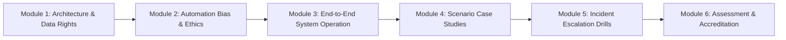
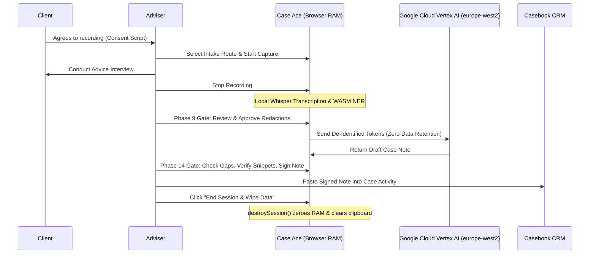

# Case Ace v2.0 - Training Manual & Delegate Workbook

**Document Reference**: CAW-TRN-MAN-2026-01  
**Course Title**: Privacy-Preserving AI in Casework: Operational Training & Accreditation for Case Ace v2.0  
**Organisation**: Citizens Advice Wandsworth (CAW)  
**Target Audience**: Qualified Generalist Advisers, Specialist Caseworkers, Supervisors, and Trainee Volunteers  
**Duration**: 3.5 Hours (Half-Day Interactive Workshop)  
**Publication Date**: 2026-09-02  
**Classification**: Official-Sensitive / Training  

---

## Welcome & Course Overview

Welcome to the official training programme and delegate workbook for **Case Ace v2.0**.

This workbook is your interactive companion during the initial accreditation session and serves as your permanent operational reference manual. As a Citizens Advice Wandsworth adviser, your core mission is providing high-quality, confidential, and impartial advice to our community. Case Ace v2.0 is designed to free you from mechanical typing so you can dedicate your full attention, empathy, and active listening to your clients.



### Course Learning Objectives
By the end of this 3.5-hour workshop, delegates will be able to:
1. Explain the **privacy-preserving architecture** of Case Ace (local Whisper transcription, in-memory WASM redaction, Google Cloud Vertex AI synthesis, and volatile RAM destruction) to clients in plain English.
2. Understand that **Microsoft Entra ID is strictly limited to the login screen**, with all AI note drafting running securely on **Google Cloud Platform (gCloud) in London (`europe-west2`)**.
3. Obtain, record, and respect **informed client consent** across Face-to-Face, Webex, and Outreach intake routes.
4. Master the **Phase 9 Redaction Gate** by identifying missed personal identifiers and removing false positives.
5. Overcome **automation bias** and rigorously critique AI-generated drafts against the **Advice Quality Standard (AQS Level 3)**.
6. Identify and resolve **Unverified Information Gaps** using the interactive audio cross-referencing tool.
7. Execute the mandatory **5-minute physical deletion protocol** for external recording devices.
8. Demonstrate swift escalation in the event of a suspected redaction failure or security incident.

> [!NOTE]
> **Data Flow Diagrams Location**:
> The complete Trust Boundary and Data Flow architectural diagrams are maintained in:
> - **Primary Specification**: [`evidence/data_flow_diagram.md`](../evidence/data_flow_diagram.md) (and matching `.docx` / `.pdf`)
> - **System Architecture Baseline**: [`docs/architecture.md`](./architecture.md) and [`docs/backend-architecture.md`](./backend-architecture.md)

---

## Workshop Schedule (3.5 Hours)

| Time | Session Content | Format / Activity |
| :--- | :--- | :--- |
| **09:00 - 09:30** | **Module 1: Privacy Architecture & Client Data Rights** | Trainer Presentation & Group Discussion |
| **09:30 - 10:15** | **Module 2: Automation Bias & Human Accountability** | Case Study Analysis & Bias Reflection Drill |
| **10:15 - 10:30** | *Morning Refreshment Break* | — |
| **10:30 - 11:30** | **Module 3: System Operation & Practice Scenarios** | Hands-On Simulation (Scenarios 1 & 2) |
| **11:30 - 12:00** | **Module 4: Advanced Intake, Accents & External Imports** | Hands-On Simulation (Scenarios 3 & 4) |
| **12:00 - 12:15** | **Module 5: Error Escalation & Incident Simulation** | Redaction Escape Drill |
| **12:15 - 12:30** | **Module 6: Knowledge Check & Accreditation Sign-Off** | Quiz & Competency Sign-Off |

---

## Module 1: Privacy Architecture & Client Data Rights

### 1.1 Why Privacy Matters at Citizens Advice Wandsworth
Clients share the most sensitive details of their lives with us—health conditions, domestic abuse histories, severe debt, immigration anxieties, and benefit claims. Any breach of this trust damages not only the client but the independent reputation of Citizens Advice nationwide.

Case Ace v2.0 was engineered specifically to eliminate cloud privacy risks:

```
+----------------------------------------------------------------------------------------------------+
| CASE ACE v2.0 PRIVACY FIREWALL                                                                     |
+----------------------------------------------------------------------------------------------------+
| 1. AUDIO RECORDING    --> Captured strictly in volatile laptop RAM (No disk save)                  |
| 2. LOCAL TRANSCRIPTION--> Whisper.cpp runs locally in browser (Zero cloud audio transfer)          |
| 3. WASM REDACTION     --> Names, NINOs, addresses converted to tokens [NAME_1], [NINO_1] in RAM    |
| 4. ENCRYPTED NOTE GEN --> Only de-identified text sent to Google Cloud Vertex AI (europe-west2)   |
| 5. ZERO MS TRAVERSAL  --> Microsoft Entra ID is for SSO login only; no case data touches Microsoft|
| 6. SESSION WIPE       --> destroySession() zeroes RAM, frees memory, and clears clipboard          |
+----------------------------------------------------------------------------------------------------+
```

### 1.2 The Three Consent Principles
1. **Voluntary & Non-Conditional**: Refusing Case Ace has **zero impact** on advice quality or waiting times.
2. **Revocable at Any Time**: If a client asks to stop recording or feels uncomfortable, click **"Withdraw Consent"** immediately. All recording ceases, and the current session is permanently destroyed.
3. **Transparent & Clear**: Always use the approved scripts in Plain English, Easy-Read format, or the Webex Telephony version.

> [!NOTE]
> **Delegate Reflection Activity 1.1**:
> A client tells you: *"I don't really understand computers... will my council housing officer or the DWP be able to hear this recording?"*  
> **How do you respond in plain, reassuring language?**  
> *(Write your response in the space below)*:  
> `________________________________________________________________________________________________`  
> `________________________________________________________________________________________________`  
> `________________________________________________________________________________________________`  

---

## Module 2: The Psychology of Automation Bias & Professional Accountability

### 2.1 Understanding Automation Bias
**Automation bias** is the natural human tendency to trust computer-generated output without sufficient scrutiny, especially when the output appears well-formatted, fluent, and confident.

```
+----------------------------------------------------------------------------------------------------+
| THE AUTOMATION BIAS TRAP                                                                           |
+----------------------------------------------------------------------------------------------------+
| 1. High-Quality Presentation --> Text looks polished, structured, and professional.                |
| 2. Cognitive Ease            --> Adviser feels tempted to "skim and click approve".                |
| 3. Missed Hallucination      --> AI mishears "Discretionary Housing Payment" as "Housing Benefit". |
| 4. Unverified Deadline       --> AI invents a 14-day appeal deadline when the statutory limit is 28|
| 5. Casebook Compromise       --> Client is misadvised, failing Advice Quality Standard (AQS).      |
+----------------------------------------------------------------------------------------------------+
```

### 2.2 The Human-in-the-Loop Golden Rule
> [!IMPORTANT]
> **Adviser Professional Liability Principle**:
> Case Ace is an **assistive drafting tool**, not an accredited caseworker.
> When you copy a case note into Casebook CRM, **you are the sole author** under Citizens Advice Wandsworth quality assurance rules. If the note contains an incorrect deadline or omits a crucial debt priority, you bear full professional responsibility.

### 2.3 Quality Standards: What Supervisors Check (AQS Level 3)
Supervisors perform weekly blind QA audits using the **AQS Case Quality Scoring Matrix**:
1. **Confirmation of Enquiry (30%)**: Did the note accurately record the client's circumstances, household, and all debts/notices?
2. **Advice Given (40%)**: Was the legal, benefit, or housing advice legally sound, comprehensive, and tailored?
3. **Agreed Action Plan (30%)**: Are tasks itemized, clearly allocated (who does what), and accompanied by explicit deadline dates?

---

## Module 3: End-to-End System Operation

### 3.1 The 5-Step Operational Routine



### 3.2 Operating the Three Intake Routes

#### Route 1: In-Person Advice
- Place USB desktop microphone equidistant between you and client.
- Deliver verbal script $\rightarrow$ Click **"Start Recording"**.
- Use **"Pause Recording"** if client steps out or shares non-casework confidential details.

#### Route 2: Cisco Webex Telephony
- Dial client on Cisco Webex softphone $\rightarrow$ Deliver telephone consent script.
- Click **"Connect Webex Call Stream"** in Case Ace.
- Call termination automatically triggers local transcription.

#### Route 3: External Audio Import (Home Visits & Outreach)
- Record on CAW-managed encrypted dictaphone.
- Connect via USB $\rightarrow$ Click **"Import External Recording"**.
- Complete note drafting $\rightarrow$ Save note to Casebook.
- **Mandatory 5-Minute Deletion**: Permanently delete file from dictaphone and laptop (`Shift+Delete` / empty Trash) $\rightarrow$ Confirm audit checkbox.

---

## Module 4: Scenario-Based Interactive Practice Cases

Work through the following 4 realistic casework scenarios on your training terminal. Complete the exercises in this workbook.

---

### Practice Case 1: Complex Debt & Rent Arrears Consultation

#### Case Summary & Dialogue Transcript
> **Client**: "I live at 14 Lavender Sweep, SW11 1HA with my two children. My landlord, Wandsworth Borough Council, served me a Notice of Seeking Possession (Section 8) on Ground 10 and 11 because I owe £2,850 in rent arrears. I also owe £1,400 on a Barclaycard and £650 for Council Tax. I work part-time as a cleaner earning £850 a month, and I receive £680 in Universal Credit. I missed my rent because my UC was reduced due to a work capability review. The notice says they can apply to court after 28 days from 15th August."  
> **Adviser**: "Thank you for explaining, Mrs. Davies. Have you contacted the council's rent income officer? And did you appeal the Universal Credit decision?"  
> **Client**: "No, I haven't contacted the council yet because I was scared. I requested a mandatory reconsideration for Universal Credit two weeks ago, but haven't heard back."

#### Delegate Exercise 1.1: Phase 9 Redaction Audit
Examine the transcript above. List all personal identifiers that MUST be redacted before note synthesis:
1. Client Name: `__________________________________________________________________`
2. Address & Postcode: `__________________________________________________________`
3. Landlord / Creditor Account IDs: `______________________________________________`
4. Financial / Income Specifics: `_________________________________________________`

#### Delegate Exercise 1.2: Information Gap & Action Plan Verification
Review the AI-generated draft note on your screen.
1. **Identify the Unverified Information Gap**:  
   `[GAP: ______________________________________________________________________]`
2. **Draft the Agreed Action Plan with explicit deadlines**:
   - **Client Actions**:
     - *Action 1*: `___________________________________________________` *Deadline*: `______`
     - *Action 2*: `___________________________________________________` *Deadline*: `______`
   - **Bureau Actions**:
     - *Action 1*: `___________________________________________________` *Deadline*: `______`
     - *Action 2*: `___________________________________________________` *Deadline*: `______`

---

### Practice Case 2: Universal Credit Managed Migration & Sanction Challenge

#### Case Summary & Dialogue Transcript
> **Client**: "My name is Tariq Al-Mansoor, NINO: JH 99 88 77 C, living at 88 Battersea Park Road. I received a Managed Migration notice moving me from Employment and Support Allowance (ESA) to Universal Credit on 1st July 2026. I made the claim on 20th July, but my payment was cut by £393.45 because the DWP claimed I failed to attend a mandatory work search review on 10th August. I have severe depression and agoraphobia, and I submitted a fit note from Dr. Bennett at Battersea Health Centre covering that whole month. I have no money for food or electricity this week."

#### Delegate Exercise 2.1: Critical Note Critique
The draft note generated by the AI states: *"Client advised to apply for a standard budgeting advance of £500."*  
**Why is this advice potentially negligent under AQS standards? What should the primary advice be?**  
*(Consider: UC Sanction Mandatory Reconsideration, Hardship Payment, and Wandsworth Local Discretionary Support)*  
`________________________________________________________________________________________________`  
`________________________________________________________________________________________________`  
`________________________________________________________________________________________________`  

---

### Practice Case 3: Section 21 Housing Eviction & Disrepair Counter-Claim

#### Case Summary & Dialogue Transcript
> **Client**: "I am renting a flat privately from Apex Properties Ltd at 102 St John's Hill, London SW11. On 1st August 2026, the agent handed me a Section 21 Form 6A notice requiring me to leave by 1st October 2026. My tenancy started on 1st February 2024. I paid a deposit of £1,500, but I never received any deposit protection certificate or prescribed information. Also, the boiler broke down in January, and there is extensive black mould in the bathroom which I reported in writing five times with no repair done."

#### Delegate Exercise 3.1: Legal Verification & Action Plan
1. Is the Section 21 notice valid under Housing Act 2004 s.213/214 (Tenancy Deposit rules)?  
   `[ ] Valid       [X] Invalid`  
   *Reasoning*: `__________________________________________________________________________`
2. What statutory disrepair counter-measures should be included in the Advice Given section?  
   `________________________________________________________________________________________________`

---

### Practice Case 4: Strong Accent / Non-Native English Speaker Consultation

#### Case Summary & Dialogue Transcript
> **Client** *(Strong West African accent, speaking rapidly)*: "Good morning madam, my name is Oluwaseun Adeleke, staying at 19 Culvert Road, Battersea. I am on a Skilled Worker Visa working as a care assistant. My employer, CarePlus Wandsworth, suddenly cut my hours from 40 hours to 15 hours last month. They also deducted £250 from my pay slip for 'visa sponsorship admin fee'. My biometric residence permit expires in November 2026, and I cannot pay my £700 room rent next week. My contract says guaranteed 37.5 hours per week."

#### Delegate Exercise 4.1: ASR Accuracy & Dialect Handling
1. Whisper local transcription transcribed "CarePlus Wandsworth" as *"care plus one's worth"* and "biometric residence permit" as *"bio metrics resident permit"*.  
   **What steps must the adviser take in the Phase 9 Gate and Editor before copying to Casebook?**  
   `________________________________________________________________________________________________`  
   `________________________________________________________________________________________________`
2. Highlight the illegal wage deduction under Employment Rights Act 1996 s.13 that must be explicitly recorded in the Advice Given section:  
   `________________________________________________________________________________________________`

---

## Module 5: Error Escalation & Incident Simulation Drill

### 5.1 Suspected Redaction Failure Protocol
If you observe a personal identifier (e.g., client full name or NINO) appearing unredacted in the synthesized draft note:

```
+----------------------------------------------------------------------------------------------------+
| REDACTION ESCAPE INCIDENT PROTOCOL                                                                 |
+----------------------------------------------------------------------------------------------------+
| 1. DO NOT COPY TO CASEBOOK --> Halt transfer immediately.                                          |
| 2. CLICK "END SESSION & WIPE" --> Triggers destroySession(), wiping volatile RAM immediately.      |
| 3. NOTE AUDIT SESSION ID      --> Record the anonymised session ID from the top header bar.        |
| 4. NOTIFY SUPERVISOR & DPO    --> Submit Material Error Report to dpo@cawandsworth.org.uk (< 2 hrs)|
| 5. REVERT TO MANUAL NOTE      --> Write standard manual note in Casebook CRM.                      |
+----------------------------------------------------------------------------------------------------+
```

### 5.2 Simulation Drill Activity
- **Scenario**: You notice that during an external import of a housing consultation, the client's partner's name "Krzysztof Kowalski" was not masked by the WASM NER engine and appears in the Advice Given text.
- **Task**: Walk through the 5 escalation steps with your workshop partner and fill out the incident notification form in Appendix A.

---

## Module 6: Knowledge Check Quiz

*Circle the correct answer or fill in the blank. Passing score: 8/10 (80%).*

1. **Where does the primary Whisper speech-to-text transcription execute?**  
   a) On a public cloud server  
   b) Locally in the adviser's web browser RAM (WebAssembly)  
   c) On an unencrypted storage disk  
   d) On the client's smartphone  

2. **What happens to the audio buffer when you click "End Session & Wipe Data"?**  
   a) It is saved to an encrypted folder on your desktop for 30 days  
   b) It is uploaded to cloud cold storage for audit review  
   c) It is permanently overwritten with zeros in RAM and destroyed  
   d) It is sent to the session supervisor via email  

3. **What role does Microsoft Entra ID play in Case Ace v2.0?**  
   a) It stores all case notes in Microsoft cloud databases  
   b) It is used strictly at the initial enterprise login screen for adviser Single Sign-On and MFA  
   c) It transcribes audio on Microsoft Azure  
   d) It automatically approves advice notes  

4. **Where are the case notes synthesized and generated?**  
   a) On Google Cloud Vertex AI (Gemini 1.5) in the London (`europe-west2`) region under Zero Data Retention  
   b) On a public commercial chatbot  
   c) On a US-based cloud server  
   d) On the local council's database  

5. **When importing an external recording from a home visit dictaphone, what is the mandatory deletion timeline for source files on the hardware and laptop?**  
   a) Within 7 working days  
   b) Within 24 hours  
   c) Immediately (within 5 minutes) using permanent deletion (`Shift+Delete`)  
   d) At the end of the calendar month  

6. **What should an adviser do if Case Ace displays an "Unverified Information Gap"?**  
   a) Ignore it and copy the note immediately  
   b) Review the gap, verify the fact (or note it as an outstanding action), and click acknowledge  
   c) Delete the entire case note and start over  
   d) Guess the missing number based on average cases  

7. **How can an adviser verify if a specific figure in the draft note was heard accurately in the consultation?**  
   a) Ring the client back to ask again  
   b) Click the sentence in the note editor to highlight and replay the exact audio snippet  
   c) Trust the AI because its accuracy is always 100%  
   d) Submit a support ticket to IT  

8. **Which of the following is an example of automation bias?**  
   a) Editing the AI draft note to correct a wrong benefit calculation  
   b) Rubber-stamping the AI draft without checking the mandatory reconsideration deadline date  
   c) Pausing recording when a client discusses sensitive third-party medical records  
   d) Manually adding a missed nickname to the Phase 9 Redaction Gate  

9. **If a client with a strong regional accent or speech impairment is recorded, what is the recommended practice?**  
   a) Advise the client that they cannot use Citizens Advice services  
   b) Pay extra attention during the Phase 9 Redaction Gate and manually verify transcript accuracy  
   c) Increase the microphone volume to 100%  
   d) Rely entirely on the AI without reading the note  

10. **In the event of a total system outage of Case Ace during a busy drop-in session, what is the business continuity procedure?**  
    a) Cancel all client appointments for the day  
    b) Revert immediately to the existing manual note-taking process in Casebook CRM  
    c) Send clients home with blank paper  
    d) Record consultations on personal mobile phones  

---

## Module 7: Delegate Competency Assessment & Professional Pledge

### Adviser Self-Assessment Checklist
Please verify that you have successfully completed all practical competencies before signing below:

- [ ] I understand how local Whisper transcription and WASM PII redaction protect client privacy.
- [ ] I understand that Microsoft is used solely for the login screen, with note drafting running on Google Cloud (`europe-west2`).
- [ ] I can deliver the plain English client consent script fluently and respect consent withdrawals.
- [ ] I have demonstrated adding manual redactions and removing false positives in Phase 9.
- [ ] I understand the dangers of automation bias and my personal professional responsibility for notes.
- [ ] I know how to click note sentences to cross-check verbatim audio snippets.
- [ ] I have practiced the 5-minute permanent deletion protocol for external dictaphones.
- [ ] I know the 5-step escalation procedure for suspected redaction escapes.

---

### Adviser Professional Pledge & Sign-Off

> *"I, the undersigned qualified adviser / caseworker at Citizens Advice Wandsworth, confirm that I have completed the Case Ace v2.0 Training Programme. I understand that Case Ace is an assistive drafting tool and that I retain sole professional responsibility for the accuracy, legality, and completeness of all case notes I submit to Casebook CRM. I pledge to critically evaluate every draft, verify all information gaps, protect client confidentiality, and adhere strictly to all data protection and deletion protocols."*

**Delegate Name**: `____________________________________________________`  
**Adviser ID / Entra OID**: `___________________________________________`  
**Signature**: `________________________________________________________`  
**Date**: `_____________________________________________________________`  

---

### Trainer Accreditation Sign-Off

**Trainer Name**: `____________________________________________________`  
**Role / Position**: `___________________________________________________`  
**Assessment Result**: `[ ] ACCREDITED / PASSED      [ ] REQUIRES FURTHER PRACTICE`  
**Trainer Signature**: `________________________________________________`  
**Accreditation Date**: `_______________________________________________`  
