# Case Ace v2.0 - Comprehensive User Guide

**Document Reference**: CAW-UG-ADV-2026-01  
**System**: Case Ace v2.0 Client Consultation Recording & Note Drafting System  
**Organisation**: Citizens Advice Wandsworth (CAW)  
**Target Audience**: Qualified Generalist Advisers, Specialist Caseworkers, Supervisors, and Trainee Volunteers  
**Effective Date**: 2026-09-02  
**Classification**: Official-Sensitive / Operational  

---

## 1. Introduction and System Overview

Welcome to **Case Ace v2.0**, an assistive, privacy-preserving consultation recording and case note drafting tool developed specifically for Citizens Advice Wandsworth (CAW). 

Case Ace assists you during client interviews by capturing the consultation audio, transcribing dialogue locally on your computer, redacting all personal identifiers in browser memory, and synthesizing structured, audit-ready case notes that strictly adhere to the **Advice Quality Standard (AQS Level 3)**.

```mermaid
flowchart LR
    A["1. Client Consent & Intake"] --> B["2. Audio Capture (Local RAM)"]
    B --> C["3. In-Browser Whisper Transcription"]
    C --> D["4. Phase 9 Redaction Gate (Local WASM)"]
    D --> E["5. Google Cloud Vertex AI (europe-west2)"]
    E --> F["6. Phase 14 Adviser Sign-Off Gate"]
    F --> G["7. Copy to Casebook CRM"]
    G --> H["8. destroySession() (RAM & Buffer Wiped)"]
```



### Core Architecture & Privacy Principles
1. **Zero Persistent Client Storage**: No client audio, raw transcripts, or identifying tokens are ever saved to your laptop hard drive, cookies, IndexedDB, or cloud databases. Everything operates strictly in volatile RAM and is wiped upon session termination.
2. **Local In-Browser Transcription & Redaction**: Speech-to-text (Whisper.cpp) and Named Entity Recognition (WASM NER) execute entirely on your local CAW device before any data reaches the cloud.
3. **Google Cloud (gCloud) Infrastructure (Zero Data Retention)**: Case note synthesis is performed exclusively on **Google Cloud Platform (gCloud)** infrastructure located in the **London (`europe-west2`)** region using **Google Cloud Vertex AI (Gemini 1.5)** under strict Zero Data Retention agreements—prompts and responses are never logged, stored, or used for model retraining.
4. **Strict Isolation of Microsoft Identity**: Microsoft integration is strictly limited to the **organisational enterprise login screen (Microsoft Entra ID)** for adviser Single Sign-On (SSO) and Multi-Factor Authentication (MFA). **No audio, transcripts, redacted text, or case notes ever traverse Microsoft or Azure systems.** Notes are generated on Google Cloud and returned directly to the browser.
5. **Human-in-the-Loop Supremacy**: Case Ace is an assistive drafting tool, not an autonomous caseworker. You retain 100% professional, legal, and ethical accountability for the final note entered into Casebook CRM.

> [!NOTE]
> **Data Flow Diagrams Location**:
> The formal, audit-verified Data Flow and Trust Boundary Maps are maintained in:
> - **Markdown**: [`evidence/data_flow_diagram.md`](../evidence/data_flow_diagram.md)
> - **Microsoft Word**: `evidence/data_flow_diagram.docx`
> - **Adobe PDF**: `evidence/data_flow_diagram.pdf`
> - **System Architecture**: [`docs/architecture.md`](./architecture.md) and [`docs/backend-architecture.md`](./backend-architecture.md)

---

## 2. System Requirements and Getting Started

### 2.1 Hardware and Browser Prerequisites
- **Device**: CAW-managed Windows or macOS laptop with minimum 8 GB RAM (16 GB recommended for high-speed local transcription).
- **Browser**: Microsoft Edge or Google Chrome (latest version) with WebAssembly and Web Audio API enabled.
- **Audio Equipment**:
  - *Face-to-Face*: CAW-supplied USB omnidirectional desktop microphone (e.g. Jabra Speak or Anker PowerConf) positioned centrally between adviser and client.
  - *Telephony*: Cisco Webex Calling softphone integration on the adviser desktop.
  - *Outreach / Home Visits*: CAW-managed encrypted hardware dictaphone or corporate smartphone.

### 2.2 Signing In via Microsoft Entra ID (Enterprise Login Screen Only)
1. Open your browser and navigate to the Case Ace application URL: `https://caseace.adviceintelligence.tech`.
2. Click **"Sign in with Citizens Advice Entra ID"**.
3. Authenticate using your `@cawandsworth.org.uk` credentials and complete the Multi-Factor Authentication (MFA) push notification on your Microsoft Authenticator app.
4. Once authenticated, your session receives a short-lived token generated by the CAW backend. All subsequent note drafting and AI operations communicate directly with Google Cloud (`europe-west2`) without touching Microsoft.

> [!IMPORTANT]
> **No Shared Logins**: You must never share credentials or use another adviser's active session. Every action is recorded in the non-PII audit ledger under your unique Entra ID Object Identifier (OID).

---

## 3. User Interface (UI) Tour

```
+----------------------------------------------------------------------------------------------------+
|  CITIZENS ADVICE WANDSWORTH | Case Ace v2.0                     [Adviser: Sarah Jenkins] [Logout]  |
+----------------------------------------------------------------------------------------------------+
|  STATUS: SESSION ACTIVE (RAM ONLY) | AUDIO ENCRYPTION: AES-GCM-256 | REGION: gCloud europe-west2   |
+----------------------------------------------------------------------------------------------------+
|                                                                                                    |
|  [ STEP 1: INTAKE & CONSENT ]  -->  [ STEP 2: CAPTURE ]  -->  [ STEP 3: REDACTION ]  --> [ NOTE ] |
|                                                                                                    |
|  +--------------------------------------------+  +-----------------------------------------------+ |
|  | LEFT PANE: TRANSCRIPTION & REDACTION       |  | RIGHT PANE: DRAFT CASE NOTE & VERIFICATION    | |
|  |                                            |  |                                               | |
|  | [Waveform Visualizer: 00:14:22]            |  | Confirmation of Enquiry:                      | |
|  | Client: My landlord issued a [REDACTED_1]  |  | Client seeks advice regarding a Section 21    | |
|  | notice requiring possession by [DATE_1].   |  | notice served on 14/08/2026.                  | |
|  |                                            |  |                                               | |
|  | Adviser: Did you pay a tenancy deposit?    |  | Advice Given:                                 | |
|  | Client: Yes, £1,200 to [REDACTED_2].       |  | Advised on deposit protection requirements    | |
|  |                                            |  | under Housing Act 2004 s.213...               | |
|  | [ + Add Redaction ] [ - Remove Redaction ] |  |                                               | |
|  |                                            |  | [ ! Unverified Gaps: 2 Items to Check ]       | |
|  +--------------------------------------------+  +-----------------------------------------------+ |
|                                                                                                    |
|  [ Copy Signed Note to Casebook ]   [ Withdraw Consent ]   [ End Session & Permanently Wipe RAM ]   |
+----------------------------------------------------------------------------------------------------+
```

### Key Screen Elements
- **Header Bar**: Displays organisation branding, active adviser ID, session elapsed timer, and gCloud `europe-west2` RAM-only security status indicator.
- **Left Pane (Transcription & Acoustic Player)**: Displays the dialogue transcript. Personal identifiers are highlighted in green. Clicking any utterance allows instant audio playback of that exact phrase.
- **Right Pane (AQS Case Note Editor)**: Displays the structured draft note categorized into *Confirmation of Enquiry*, *Advice Given*, and *Agreed Action Plan*.
- **Unverified Gap Alert Box**: Flags critical missing facts (e.g. unstated dates, unverified benefit amounts, missing tenancy terms) that require adviser manual confirmation.
- **Action Footer**: Contains the primary workflow buttons: *Copy Signed Note to Casebook*, *Withdraw Consent*, and *End Session & Permanently Wipe RAM*.

---

## 4. Step-by-Step Consultation Procedures

### 4.1 Route A: In-Person Office Consultations

1. **Client Welcome & Consent Script**:
   - Welcome the client to the interview room.
   - Deliver the standard verbal consent explanation:
     > *"Before we begin, I would like to use Case Ace, an assistive computer tool that helps me write our case notes. It records our voices so I can focus completely on you instead of typing. The system removes all names, dates of birth, and addresses on this laptop before drafting the note, and the recording is permanently deleted as soon as our appointment ends. You are completely free to say no, and it will not affect your advice today. Are you happy for me to use it?"*
   - If the client agrees, select **"Face-to-Face Consultation"** in Case Ace and click **"Client Consented - Begin Capture"**.
2. **Audio Capture**:
   - Ensure the microphone is placed centrally. Click **"Start Recording"**.
   - A pulsing green indicator and live waveform confirm active capture.
   - If the client discusses highly sensitive third-party details or asks for a pause, click **"Pause Recording"** (or click **"Withdraw Consent"** if they change their mind).
3. **Concluding the Interview**:
   - When the advice session finishes, click **"Stop Recording & Process Note"**.
   - The local Whisper model transcribes the dialogue into volatile RAM within 10–25 seconds.

---

### 4.2 Route B: Cisco Webex Telephone Consultations

1. **Connecting the Call**:
   - Answer or dial the client in your Cisco Webex softphone app.
   - Deliver the mandatory Telephone Consent Script:
     > *"Hello, I am calling from Citizens Advice Wandsworth. To ensure our notes are accurate, I am using our secure note-drafting system today. It removes all names, account numbers, and addresses before drafting our summary, and the audio is wiped immediately after the call. Are you happy for me to proceed with this?"*
2. **Streaming into Case Ace**:
   - In Case Ace, select **"Cisco Webex Telephony"** and click **"Connect Webex Call Stream"**.
   - Case Ace captures both the adviser microphone and client telephony channel via dual-channel loopback in browser memory.
3. **Hangup Detection**:
   - When you disconnect the Webex call, Case Ace automatically detects line termination and begins transcription.

---

### 4.3 Route C: Importing Externally Captured Audio (Home Visits & Outreach)

> [!CAUTION]
> **Strict 5-Minute Physical Deletion Protocol**:
> Audio recorded on external dictaphones or CAW mobile phones outside the bureau carries high physical data risk. You must adhere to the 5-minute permanent deletion rule.

```
+----------------------------------------------------------------------------------------------------+
| EXTERNAL AUDIO IMPORT LIFECYCLE                                                                    |
+----------------------------------------------------------------------------------------------------+
| 1. Field Capture  --> 2. USB Connection --> 3. Browser Import --> 4. Redact & Draft                |
| (Dictaphone / SD)     (CAW Laptop Only)     (RAM Processing)      (gCloud europe-west2)            |
|                                                                          |                         |
| 7. Casebook Saved <-- 6. Shift+Delete   <-- 5. Wipe Dictaphone    <-- Note Signed Off              |
| (6-Yr Casework Rec)   (Laptop Disk Wipe)    (Zero Hardware Mem)                                    |
+----------------------------------------------------------------------------------------------------+
```

1. **Connect Hardware**: Plug your CAW dictaphone into your laptop via USB.
2. **Upload Audio**: Click **"Import External Recording"** in Case Ace and select the recording file (`.wav`, `.mp3`, `.m4a`, `.aac`, `.mp4`).
3. **Video Stripping**: If an MP4/MOV video is imported, Case Ace instantly separates the audio track and discards the video buffer from memory.
4. **Draft Note**: Proceed through the Phase 9 Redaction Gate and Phase 14 Note Sign-Off Gate.
5. **Immediate Mandatory Physical Deletion**:
   - Open File Explorer / Finder.
   - Delete the source recording file directly from the dictaphone memory.
   - Delete any temporary file from your `Downloads/` or `Documents/` folder using **Permanent Delete** (`Shift+Delete` on Windows / `Option+Cmd+Delete` on Mac) and empty your Recycle Bin / Trash.
   - Eject and unplug the dictaphone.
6. **Audit Confirmation**: Check the mandatory box in Case Ace: *"I confirm that all local source audio files have been permanently deleted from this computer and external media."*

---

## 5. Navigating the Phase 9 Redaction Review Gate

The **Phase 9 Redaction Review Gate** is the core privacy checkpoint of Case Ace. It guarantees that zero PII leaves your browser.

```
+----------------------------------------------------------------------------------------------------+
| PHASE 9 REVIEW GATE: DETECTED IDENTIFIERS                                                          |
+----------------------------------------------------------------------------------------------------+
| The following personal identifiers were detected and will be replaced with cryptographic tokens:   |
|                                                                                                    |
| • [CLIENT_NAME_1]   -> "David Miller"            [Confidence: 99.4%]   [Keep] [Remove]             |
| • [NINO_1]          -> "QQ 12 34 56 A"           [Confidence: 100.0%]  [Keep] [Remove]             |
| • [ADDRESS_1]       -> "42 Falcon Road, SW11"    [Confidence: 98.8%]   [Keep] [Remove]             |
| • [PHONE_1]         -> "07700 900123"            [Confidence: 99.1%]   [Keep] [Remove]             |
| • [HEALTH_COND_1]   -> "Multiple Sclerosis"      [Confidence: 96.5%]   [Keep] [Remove]             |
|                                                                                                    |
| [ + Manual Redaction: Highlight any missed word and click 'Redact Selected' ]                      |
|                                                                                                    |
| [✓ Approve Redactions & Transmit Anonymised Stream to Google Cloud Vertex AI]                      |
+----------------------------------------------------------------------------------------------------+
```

### 5.1 Verifying and Modifying Redactions
1. **Review Highlighted Entities**: Check the green-highlighted tokens in the transcript.
2. **Adding a Missed Redaction**: If a unique nickname, employer name, or unusual reference number was missed:
   - Highlight the text with your cursor.
   - Click **"Redact Selected Text"** and assign the category (e.g., Name, Address, Account Number).
3. **Removing a False Positive**: If a non-identifying word was mistakenly tagged (e.g. "Falcon" in "Falcon Road Advice Centre"):
   - Click the green tag and select **"Remove Redaction (Keep Original)"**.
4. **Approve & Proceed**: Click **"Approve Redactions & Generate Case Note"**.
   - The application acoustic engine verifies the audio timestamps, mutes the underlying audio waveforms across all redacted spans, and transmits the de-identified surrogate tokens to Google Cloud Vertex AI (`europe-west2` London).

---

## 6. Navigating the Phase 14 Note Review & Sign-Off Gate

Once the anonymized case note is synthesized on Google Cloud and returned to the browser, Case Ace presents the draft in the right-hand editor.

### 6.1 Checking Note Structure Against AQS Standards
Verify that the generated note contains all mandatory AQS sections:
1. **Confirmation of Enquiry**: Background, presenting issue, household composition, benefit status, landlord/creditor details.
2. **Advice Given**: Statutory rights explained, benefit entitlement calculations, debt options (DRO, IVA, Bankruptcy, Breathing Space), housing defense options.
3. **Agreed Action Plan**: Numbered, itemized tasks clearly allocated between the client and the bureau, each with explicit deadline dates.

### 6.2 Managing Unverified Information Gaps
If the client did not mention an essential piece of information, Case Ace highlights an **Unverified Information Gap**:
- *Example*: `[GAP: Tenancy start date not stated in consultation - Verify before serving defense]`
- You must review each gap banner and click **"Acknowledge Gap"** or insert the verified detail directly into the text editor.

### 6.3 Verifying Audio Snippets (Cross-Referencing)
- If you are unsure whether a specific figure or date was captured correctly, **click that sentence in the note editor**.
- Case Ace immediately highlights the corresponding transcript section and provides a **Play Snippet** button to listen to the original audio recording.

### 6.4 Professional Sign-Off & Transfer to Casebook CRM
1. Read through the complete note and make any necessary editorial corrections.
2. Check the mandatory declaration checkbox:
   - `[X] I confirm that I have reviewed, verified, and edited this case note. I take full professional responsibility for its accuracy under Citizens Advice Wandsworth standards.`
3. Click **"Copy Signed Note to Clipboard"**.
4. Switch to **Casebook CRM**, open the client's case record, paste the text into the Case Activity field (`Ctrl+V` / `Cmd+V`), and save.

---

## 7. Session Termination and Data Sanitization

Case Ace enforces deterministic session destruction across **6 distinct exit paths**:

```
+----------------------------------------------------------------------------------------------------+
| 6 DETERMINISTIC SESSION EXIT PATHS                                                                 |
+----------------------------------------------------------------------------------------------------+
| 1. Explicit Session End  --> User clicks "End Session & Wipe Data"                                 |
| 2. Adviser Logout        --> User clicks "Logout" in header                                        |
| 3. Inactivity Timeout    --> 15 minutes of zero keyboard/mouse activity                            |
| 4. Consent Withdrawal    --> Client withdraws consent at any point during consultation            |
| 5. Browser Tab Close     --> Adviser closes tab or window (beforeunload event)                     |
| 6. Unrecoverable Error   --> Fatal network or WASM crash occurs                                    |
+----------------------------------------------------------------------------------------------------+
```

### What Happens During `destroySession()`:
- All audio buffers in browser RAM are overwritten with zeros (`0x00`).
- The transcript text and token mapping tables are garbage-collected and destroyed.
- The Web Worker threads running Whisper and WASM NER are terminated immediately.
- The system clipboard is cleared of any detokenized case note text.
- A non-PII audit record (`SESSION_DESTROYED`) is written to the immutable log.

---

## 8. Troubleshooting and Error Handling

| Symptom / Error Message | Root Cause | Action Required |
| :--- | :--- | :--- |
| **"Microphone access denied"** | Browser permissions blocked | Click the padlock icon in the browser address bar $\rightarrow$ Set Microphone to *Allow* $\rightarrow$ Refresh page. |
| **"Local Whisper model failed to load"** | Slow network during initial asset cache | Check internet connection, clear browser cache, and reload Case Ace. The model caches locally after first load. |
| **"Webex stream not detected"** | Webex calling softphone not active | Ensure Cisco Webex is open and logged into your CAW account before clicking "Connect Webex Stream". |
| **"ASR transcription accuracy degraded"** | Strong background noise or heavy accent | Switch to external lapel mic; perform manual review of transcript in Phase 9; correct terms directly in editor. |
| **"Network timeout during note generation"** | gCloud connection dropped | Click "Retry Note Generation". Redacted transcript remains safely in volatile RAM. |
| **Total System Unavailability** | Infrastructure outage | **Business Continuity Fallback**: Revert immediately to standard manual note-taking in Casebook CRM. Advice delivery is never delayed. |

---

## 9. Adviser Support and Escalation

- **Technical Support & Bug Reporting**: Email `itsupport@cawandsworth.org.uk` or submit an IT ticket.
- **Supervisor QA Queries**: Contact your Session Supervisor or Lead Caseworker.
- **Data Protection & Incident Escalation**: If you suspect a redaction failure or personal data breach, immediately follow the *Material Error & Incident Escalation Procedure* and notify `dpo@cawandsworth.org.uk` within 2 hours.
