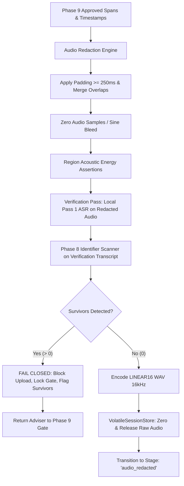

# Case Ace v2.0 — Phase 10: Audio Redaction and Verification

## 1. Overview and Invariants

Phase 10 provides client-side acoustic redaction and mandatory verification of consultation audio before any speech data is transmitted to upstream processing services (such as Cloud Speech-to-Text v2).

It implements the following core constitutional invariants:
* **Constraint C1 / C4 (Volatile Memory Discipline & Immediate Release)**: Raw, unredacted consultation audio is stored strictly in memory and is completely zeroed and dereferenced once the redacted version is verified.
* **Constraint C8 (Fail-Closed Acoustic Verification)**: Audio redaction is verified by re-running local Pass 1 ASR on the redacted audio. If any identifier survives in the verification transcript, upload is strictly blocked, the session returns to the Phase 9 Redaction Review Gate with survivors highlighted, and the adviser must re-approve.
* **Configurable Padding ($\ge 250\text{ms}$ Enforcement)**: Word-level timestamps drift and acoustic transients precede and succeed phonetic boundaries. A minimum padding of $250\text{ms}$ is strictly enforced on both sides of every redaction span.
* **Interval Merging**: Adjacent and overlapping redaction spans within padding distance are merged into contiguous silencing blocks to eliminate micro-gaps that could leak partial phonemes.
* **Region-Level Acoustic Assertions**: Muted regions are mathematically verified in memory to ensure $\text{RMS} < 0.00001$ (pure digital silence) and exact duration preservation.

---

## 2. Architecture & Pipeline

---

## 3. Mathematical & Acoustic Specifications

### 3.1 Padding Calculation & Interval Merging
For any approved redaction span $i$ with audio bounds $[t_{start, i}, t_{end, i}]$:
$$t_{pad} = \max(250\text{ms}, t_{config\_padding})$$
$$t'_{start, i} = \max(0.0, t_{start, i} - t_{pad})$$
$$t'_{end, i} = \min(t_{duration}, t_{end, i} + t_{pad})$$

If two padded intervals $[t'_{start, i}, t'_{end, i}]$ and $[t'_{start, j}, t'_{end, j}]$ satisfy:
$$t'_{start, j} \le t'_{end, i} + t_{merge\_threshold} \quad (t_{merge\_threshold} = 100\text{ms})$$
They are merged into a single contiguous interval:
$$I_{merged} = [t'_{start, i}, \max(t'_{end, i}, t'_{end, j})]$$

### 3.2 Acoustic Energy Assertions
For every merged silencing interval $I_k$ spanning sample range $[s_{start}, s_{end}]$ with $N_k = s_{end} - s_{start}$ samples:
$$\text{RMS}_k = \sqrt{\frac{1}{N_k} \sum_{n=s_{start}}^{s_{end}-1} x[n]^2}$$
$$\text{Peak}_k = \max_{n \in [s_{start}, s_{end}-1]} |x[n]|$$

**Assertion Rule**: In `'silence'` mode, $\text{RMS}_k \le 1\times 10^{-5}$ and $\text{Peak}_k \le 1\times 10^{-5}$. Any higher residual energy triggers an immediate runtime exception and aborts the pipeline.

### 3.3 LINEAR16 WAV Encoding
* **Sample Rate**: $16,000\text{ Hz}$
* **Channels**: $1\text{ (Mono)}$
* **Bit Depth**: $16\text{-bit signed integer PCM (Little-Endian)}$
* **Byte Rate**: $32,000\text{ bytes/sec}$
* **Container**: 44-byte standard RIFF WAVE header followed by 16-bit PCM payload.

---

## 4. Fail-Closed Verification Protocol (Constraint C8)

1. The redacted audio is passed directly to local ASR (simulated or WebGPU Whisper).
2. The resulting verification transcript is fed into `IdentifierEngine.detectIdentifiers()`.
3. If any surviving identifier (structured, named entity, or special category) is found:
   * `VolatileSessionStore.setVerificationFailure(survivors, verificationTranscript)` is invoked.
   * `isGatePassed` is flipped to `false`.
   * The unredacted raw audio is preserved in volatile memory so the adviser can review and expand time boundaries.
   * Telemetry logs a `redaction_verification_failed` event without PII.
   * The UI directs the adviser back to Phase 9 with survivor cards.
4. If zero surviving identifiers are found:
   * LINEAR16 WAV buffer is created.
   * `VolatileSessionStore.commitVerifiedRedactedAudio()` overwrites `rawAudioBuffer` with zeros (`Uint8Array.fill(0)`) and sets the pointer to `null`.
   * Session advances to `audio_redacted`.
