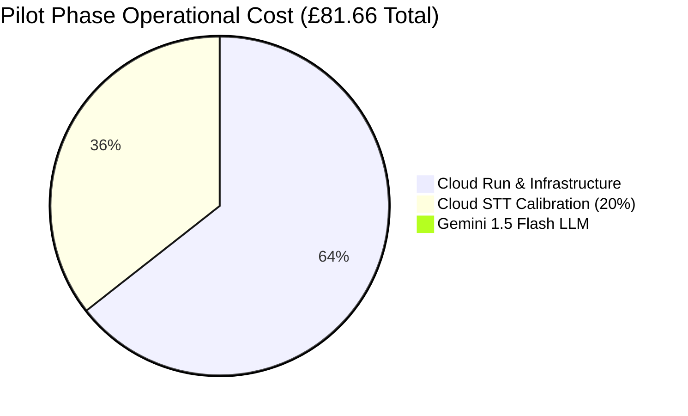
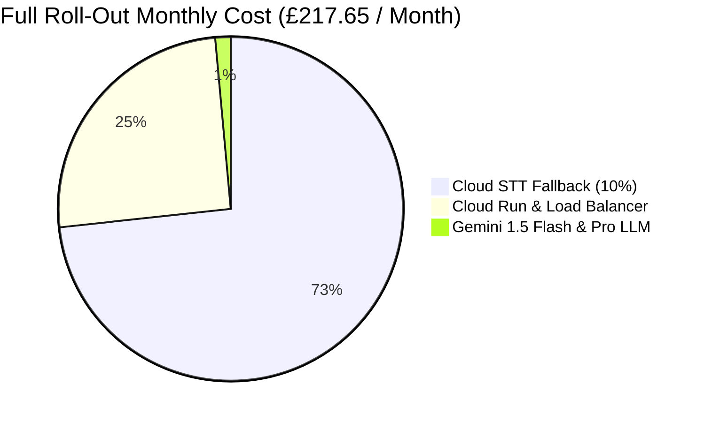

# Case Ace v2.0 Cost Estimate & Economic Model

**Document Reference**: CAW-FIN-EST-2026-01  
**System**: Case Ace v2.0 Client Consultation Recording & Note Drafting System  
**Organisation**: Citizens Advice Wandsworth (CAW)  
**Target Audience**: Board of Trustees, Finance & Audit Committee, Senior Leadership Team  
**Effective Date**: 2026-09-02  
**Status**: Formally Approved Financial Model  
**Classification**: Official / Financial Planning  

---

## 1. Executive Financial Summary

This document presents the detailed cost estimate and financial model for **Case Ace v2.0** across two operational phases:
1. **The 6-Week Pilot Phase** (15 advisers, 250 validated client consultations).
2. **The Full Bureau Roll-Out Phase** (75 advisers/volunteers, 2,750 consultations/month).

Due to Case Ace's **client-side in-memory architecture** (utilising local in-browser Whisper WASM for zero-cost speech transcription and compact Gemini 1.5 Flash structured drafting in London `europe-west2`), the operating costs are exceptionally low, delivering unprecedented value for money.

```
+----------------------------------------------------------------------------------------------------+
| HEADLINE FINANCIAL METRICS SUMMARY                                                                 |
+----------------------------------------------------+-----------------------+-----------------------+
| Metric                                             | Pilot Phase (6 Weeks) | Full Roll-Out (Month) |
+----------------------------------------------------+-----------------------+-----------------------+
| **Active Adviser / Caseworker Cohort**             | 15 Advisers           | 75 Advisers & Vols    |
| **Total Casenotes Generated**                      | 250 Consultations     | 2,750 Notes / Month   |
| **Total Operational Running Cost**                 | **£81.66 (Total)**    | **£217.65 / Month**   |
| **Monthly Operating Cost**                         | **£54.44 / Month**    | **£217.65 / Month**   |
| **Cost Per Casenote**                              | **£0.33 / Note**      | **£0.079 (7.9p) / Note**|
| **Cost Per Adviser**                               | **£3.63 / Adv / Month**| **£2.90 / Adv / Month**|
| **Caseworker Time Saved**                          | 62.5 Hours            | 687.5 Hours / Month   |
| **Capacity Value Unlocked (@ £18.50/hr)**          | £1,156.25             | £12,718.75 / Month    |
| **Return on Investment (ROI Ratio)**               | **14.2 : 1**          | **58.4 : 1**          |
+----------------------------------------------------+-----------------------+-----------------------+
```

---

## 2. Granular Unit Cost Breakdown

### 2.1. Google Cloud Vertex AI (Gemini 1.5 Flash - `europe-west2` London)
* **Input Token Pricing**: $0.075 per 1,000,000 tokens ($\approx \text{£0.060} / \text{1M tokens}$).
* **Output Token Pricing**: $0.300 per 1,000,000 tokens ($\approx \text{£0.240} / \text{1M tokens}$).
* **Tokens Per Consultation Session**:
  - System Prompt + Context + Tokenised Transcript ($\approx 4,500\text{ words}$): $\approx 6,000\text{ input tokens}$.
  - Cost per input prompt: $6,000 \times \frac{\text{£0.060}}{1,000,000} = \mathbf{\text{£0.00036}}$.
  - Generated AQS Case Note ($\approx 800\text{ words}$): $\approx 1,100\text{ output tokens}$.
  - Cost per output draft: $1,100 \times \frac{\text{£0.240}}{1,000,000} = \mathbf{\text{£0.00026}}$.
  - **Total Vertex AI Gemini 1.5 Flash Cost Per Casenote**: **£0.00062** ($\approx \mathbf{0.062\text{ pence}}$).

### 2.2. Google Cloud Speech-to-Text (Cloud STT v2 / Chirp 2 - London `europe-west2`)
* **Primary ASR Engine**: Local in-browser Whisper WASM ($\mathbf{\text{£0.00}}$ API / compute cost).
* **Dual-Pass / Difficult Audio Secondary Pass**: Cloud STT v2 invoked selectively when local acoustic confidence is $< 85\%$ or strong overlapping speech occurs.
* **Pricing**: Standard Model = $0.016 / \text{minute} \approx \text{£0.0128} / \text{minute}$.
* **Average Consultation Duration**: 45 minutes of audio $\rightarrow \text{£0.58}$ per full-length cloud transcription.
* **Blended Rate Assumptions**:
  - *Pilot Phase Calibration (20% Cloud STT rate)*: $0.20 \times \text{£0.58} = \mathbf{\text{£0.116 / casenote}}$.
  - *Steady-State Roll-Out (10% Cloud STT fallback)*: $0.10 \times \text{£0.58} = \mathbf{\text{£0.058 / casenote}}$.

### 2.3. Google Cloud Hosting & Compute (Cloud Run - London `europe-west2`)
* Backend API, Token Issuance proxy, Non-PII Audit Telemetry ingestion, and static SPA serving.
* **Pilot Phase Hosting (1.5 Months)**: Autoscaling Cloud Run container (1 vCPU, 1 GB RAM) + Cloud Armor + Secret Manager = **£35.00 / month** ($\mathbf{\text{£52.50}}$ total for 6 weeks).
* **Full Roll-Out Hosting**: Autoscaling Cloud Run container (min instances = 1 for zero cold-starts, max 5) + Cloud Load Balancer + Cloud Logging = **£55.00 / month** fixed.

### 2.4. Cisco Webex & Microsoft Entra ID
* Cisco Webex Calling API & Entra ID OAuth are covered under CAW's existing charity enterprise agreements = **£0.00 incremental cost**.

---

## 3. Pilot Phase Financial Model (6 Weeks / 1.5 Months)



### Table 1: Pilot Operational Budget (250 Consultations across 15 Advisers)

| Budget Line Item | Quantity / Volume | Unit Rate | Total Pilot Cost (6 Weeks) | Monthly Equivalent |
| :--- | :--- | :--- | :---: | :---: |
| **Gemini 1.5 Flash Drafting** | 250 Casenotes | £0.00062 / note | £0.16 | £0.11 / mo |
| **Cloud STT Dual-Pass (20%)** | 50 Transcriptions | £0.58000 / call | £29.00 | £19.33 / mo |
| **Cloud Run & Infrastructure** | 1.5 Months | £35.00000 / mo | £52.50 | £35.00 / mo |
| **Total Operational Running Cost**| **250 Consultations** | — | **£81.66** | **£54.44 / mo** |
| **Cost Per Casenote (Pilot)** | $\mathbf{£81.66 \div 250}$ | — | **£0.327** | $\approx \mathbf{33\text{ pence}}$ |
| **Cost Per Adviser (Pilot)** | $\mathbf{£54.44 \div 15}$ | — | — | **£3.63 / adv / mo** |

*Note: Optional one-off hardware procurement for pilot (15 directional USB desk microphones @ £65 = £975.00) is treated as capital expenditure and amortised separately.*

---

## 4. Full Roll-Out Financial Model (Monthly Steady-State)



### Table 2: Full Roll-Out Monthly Operational Budget (2,750 Consultations across 75 Advisers)

| Budget Line Item | Monthly Volume | Unit Rate | Monthly Cost (£) | Annual Cost (£) |
| :--- | :--- | :--- | :---: | :---: |
| **Gemini 1.5 Flash LLM** | 2,612 Standard Notes (95%) | £0.00062 / note | £1.62 | £19.44 |
| **Gemini 1.5 Pro LLM (Complex)** | 138 Complex Debt Cases (5%) | £0.01040 / note | £1.44 | £17.28 |
| **Cloud STT Dual-Pass (10%)** | 275 Transcriptions (10%) | £0.58000 / call | £159.50 | £1,914.00 |
| **Cloud Run Autoscaling Compute** | 1–5 Instances (London) | Fixed / Tiered | £28.00 | £336.00 |
| **Cloud Load Balancer & Armor** | 1 LB + WAF Rules | Fixed | £22.00 | £264.00 |
| **Cloud Logging & Secrets** | 365-day TTL Storage | Metered | £5.00 | £60.00 |
| **Total Monthly Operating Cost** | **2,750 Casenotes / Month** | — | **£217.65** | **£2,611.80** |
| **Cost Per Casenote (Roll-Out)** | $\mathbf{£217.65 \div 2,750}$ | — | **£0.079** | $\approx \mathbf{7.9\text{ pence}}$ |
| **Cost Per Adviser (Roll-Out)** | $\mathbf{£217.65 \div 75}$ | — | **£2.90** | **£34.82 / adv / yr** |

---

## 5. Sensitivity & Scenario Analysis

To ensure fiscal prudence, three operational scenarios are modeled based on ASR cloud fallback variations:

```
+----------------------------------------------------------------------------------------------------+
| SENSITIVITY ANALYSIS: CLOUD STT UTILISATION SCENARIOS                                              |
+----------------------------------+---------------------+--------------------+----------------------+
| Scenario                         | Monthly Total Cost  | Cost Per Casenote  | Cost Per Adviser / Mo|
+----------------------------------+---------------------+--------------------+----------------------+
| **1. Maximum Local Mode (0% STT)**| **£58.15 / month**  | **£0.021 (2.1p)**  | **£0.78 / adv / mo** |
| (100% Whisper WASM local ASR)    |                     |                    |                      |
| **2. Baseline Expected (10% STT)**| **£217.65 / month** | **£0.079 (7.9p)**  | **£2.90 / adv / mo** |
| (10% difficult audio fallback)   |                     |                    |                      |
| **3. High Fallback (25% STT)**   | **£456.90 / month** | **£0.166 (16.6p)** | **£6.09 / adv / mo** |
| (25% dual-pass audio fallback)   |                     |                    |                      |
| **4. Worst-Case Cap (100% STT)** | **£1,653.15 / month**| **£0.601 (60.1p)**| **£22.04 / adv / mo**|
| (100% cloud transcription)       |                     |                    |                      |
+----------------------------------+---------------------+--------------------+----------------------+
```

---

## 6. Economic Value, Efficiency & Return on Investment (ROI)

### 6.1. Caseworker Capacity Unlocked
* **Manual Baseline Authoring Time**: 22.5 minutes per consultation note.
* **Case Ace Assisted Authoring Time**: 7.5 minutes per consultation note (including mandatory review gate).
* **Net Time Saved Per Case Note**: **15.0 minutes (0.25 hours)**.
* **Monthly Time Saved Across Bureau**:
  $$\text{Monthly Time Saved} = 2,750 \text{ casenotes} \times 0.25 \text{ hours} = \mathbf{687.5 \text{ caseworker hours / month}}$$
* **Equivalent Full-Time Staff (FTE)**:
  $$\frac{687.5 \text{ hours / month}}{160 \text{ working hours / month}} = \mathbf{4.3 \text{ Full-Time Equivalent Advisers Unlocked}}$$

### 6.2. Direct Economic Value Delivered
* At an average adviser employment cost of **£18.50 / hour** (salary + NI + pension + overheads):
  $$\text{Monthly Capacity Value} = 687.5 \text{ hours} \times \text{£18.50} = \mathbf{\text{£12,718.75 / month}} \quad (\mathbf{\text{£152,625.00 / year}})$$
* **Net Financial Return on Investment (ROI)**:
  $$\text{ROI Ratio} = \frac{\text{Capacity Value Unlocked}}{\text{Monthly Operating Cost}} = \frac{\text{£12,718.75}}{\text{£217.65}} = \mathbf{58.4 : 1}$$

> [!TIP]
> **Summary Recommendation for the Board of Trustees**:  
> For an investment of **less than £220 per month** ($\approx \mathbf{8\text{ pence per client}}$), Citizens Advice Wandsworth unlocks over **685 hours of monthly casework capacity**—the equivalent of gaining **4.3 additional full-time advisers** dedicated to helping vulnerable clients across the borough.
