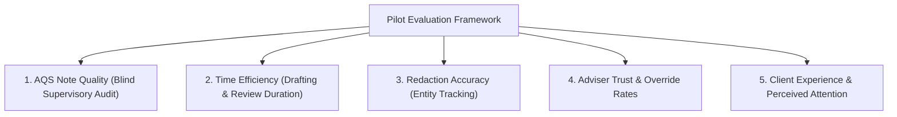

# Pilot Evaluation Framework & KPI Measurement Methodology

**Document Reference**: CAW-PILOT-EVAL-2026-01  
**System**: Case Ace v2.0 Client Consultation Recording & Note Drafting System  
**Organisation**: Citizens Advice Wandsworth (CAW)  
**Standard**: Advice Quality Standard (AQS Level 3) & ISO/IEC 42001:2023  
**Status**: Formally Approved Evaluation Framework  
**Classification**: Internal / Operational Pilot  

---

## 1. Overview of Evaluation Dimensions

The pilot evaluation framework assesses Case Ace v2.0 across five core evaluation pillars:
1. **Pillar 1: Note Quality against AQS Level 3 Standard**
2. **Pillar 2: Adviser Time Efficiency & Casework Velocity**
3. **Pillar 3: Redaction Recall & Precision in Live Consultations**
4. **Pillar 4: Adviser Trust, Engagement & Override Rates**
5. **Pillar 5: Client Experience, Dignity & Consultation Quality**



---

## 2. Key Performance Indicators (KPIs) & Target Benchmarks

```
+----------------------------------------------------------------------------------------------------+
| PILOT EVALUATION KPIS AND TARGET BENCHMARKS                                                        |
+----------------------------------------------------------------------------------------------------+
| Evaluation Dimension    | Specific KPI Metric                       | Baseline (Manual) | Pilot Target     |
+----------------------------------------------------------------------------------------------------+
| **1. AQS Note Quality** | % of notes passing AQS Level 3 audit      | 88.5%             | $\ge \mathbf{95.0\%}$|
|                         | Average supervisory score (/100)          | 82.4              | $\ge \mathbf{90.0}$  |
|                         | Missing statutory deadlines rate          | 4.2%              | $\le \mathbf{0.5\%}$ |
| **2. Time Efficiency**  | Note drafting time per consultation       | 22.5 mins         | $\le \mathbf{6.0\text{ mins}}$|
|                         | Daily casework write-up backlog (hours)   | 1.8 hrs/day       | $\le \mathbf{0.3\text{ hrs/day}}$|
| **3. Redaction Perf**   | Live entity recall rate                   | N/A               | $\ge \mathbf{92.0\%}$|
|                         | Unredacted PII network leak rate          | 0%                | $\mathbf{0\%}\text{ (Zero Invariant)}$|
| **4. Adviser Trust**    | Adviser satisfaction index (/5.0)         | 2.8 (Manual)      | $\ge \mathbf{4.2 / 5.0}$|
|                         | Mean Review Gate inspection time          | N/A               | $45\text{s} - 90\text{s}$|
|                         | Review Gate entity override rate          | N/A               | $5\% - 15\%$ (Active Engaged)|
| **5. Client Experience**| Client comfort with recording             | N/A               | $\ge \mathbf{90.0\%}$ Positive|
|                         | Perceived adviser eye contact/engagement   | 72% Positive      | $\ge \mathbf{92.0\%}$ Positive|
+----------------------------------------------------------------------------------------------------+
```

---

## 3. Data Collection Methodology

### 1. Blind Quality Audits (Pillar 1)
* Lead Supervisors review 50 randomly selected Casebook case notes drafted during the pilot, mixed with 50 notes drafted manually.
* The review is completely blind (supervisors do not know which notes were generated with Case Ace).
* Scored using the standard AQS Level 3 Quality Sheet (Enquiry Confirmation, Advice Accuracy, Action Plan, Deadlines).

### 2. Automated Non-PII Telemetry Aggregation (Pillars 2 & 3)
* Aggregates anonymised operational telemetry from `AuditLogStore`:
  - `timeSpentAtReviewGateSeconds`
  - `draftToSignOffSeconds`
  - `identifiersAddedOrRemovedByAdviser`
  - `gapsAcknowledgedCount`
* Calculates statistical distribution (median, 90th percentile) of note completion times without accessing text content.

### 3. Adviser Surveys & Focus Groups (Pillar 4)
* Weekly 5-question pulse surveys measuring cognitive load, perceived note accuracy, and tool confidence.
* Mid-pilot focus group (Week 3) and post-pilot debrief (Week 6) to gather qualitative feedback on UI workflow and error friction.

### 4. Voluntary Client Exit Survey (Pillar 5)
* Short 3-question paper or tablet survey offered to consenting clients at the conclusion of their consultation:
  1. *"Did you feel the adviser listened to you and understood your situation?"* (1–5 scale)
  2. *"How comfortable did you feel with the audio recording helper used today?"* (Very Comfortable / Comfortable / Neutral / Uncomfortable)
  3. *"Did the adviser explain how your privacy is protected?"* (Yes / No)
