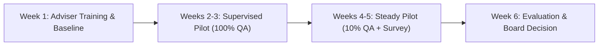

# Pilot Protocol & Operational Deployment Plan

**Document Reference**: CAW-PILOT-PROT-2026-01  
**System**: Case Ace v2.0 Client Consultation Recording & Note Drafting System  
**Organisation**: Citizens Advice Wandsworth (CAW)  
**Target Bureau Cohorts**: Battersea Bureau, Roehampton Outreach, and Central Telephony  
**Duration**: 6 Weeks (October 12, 2026 – November 20, 2026)  
**Sample Target**: 15 Generalist Advisers, Minimum 250 Live Advice Consultations  
**Status**: Formally Approved Pilot Protocol  
**Classification**: Internal / Operational Pilot  

---

## 1. Pilot Purpose & Strategic Objectives

The primary objective of the Case Ace v2.0 pilot is to evaluate the real-world operational feasibility, note quality, privacy preservation, and adviser experience of assistive case note drafting in live advice environments.



---

## 2. Pilot Cohort & Sample Size

```
+----------------------------------------------------------------------------------------------------+
| PILOT PARTICIPANT COHORT BREAKDOWN                                                                 |
+----------------------------------------------------------------------------------------------------+
| Advice Channel             | Adviser Cohort Size        | Target Consultations (6 Weeks)           |
+----------------------------------------------------------------------------------------------------+
| **In-Person Consultations**| 6 Generalist Advisers      | 110 Consultations (Battersea / Roehampton) |
| **Webex Telephony**        | 5 Adviceline Advisers      | 100 Consultations (Wandsworth Hub)        |
| **Outreach / Home Visits** | 4 Specialist Caseworkers   | 40 Consultations (Dictaphone Import)      |
| **Total Pilot Scope**      | **15 Qualified Advisers**  | **250 Validated Consultations**           |
+----------------------------------------------------------------------------------------------------+
```

### Participant Selection Criteria:
* Mixture of full-time caseworkers, part-time generalist advisers, and experienced volunteer advisers.
* Representation across core advice categories: Welfare Benefits & Universal Credit (40%), Debt & Money (25%), Housing & Homelessness (20%), Employment & Energy (15%).

---

## 3. Phased 6-Week Pilot Timeline

### Phase 1: Preparation & Training (Week 1)
* Comprehensive 3-hour hands-on training for all 15 participating advisers.
* Practice with synthetic scenarios, Review Gate editing, and Easy-Read consent delivery.
* Baseline measurement of manual note-taking duration (average time spent per consultation without Case Ace).

### Phase 2: High-Supervision Live Rollout (Weeks 2–3)
* Live consultations begin with Case Ace assistance.
* **100% Supervisory QA**: Every case note drafted with Case Ace is reviewed by a Lead Supervisor before formal case file closure in Casebook CRM.
* Daily 15-minute operational standups with IT support to resolve minor UI friction.

### Phase 3: Steady-State Operations (Weeks 4–5)
* Transition to standard **10% random supervisory sampling**.
* Intermediate telemetry review (monitoring latency, override frequency, and gap acknowledgments).
* Client exit surveys administered to consenting clients.

### Phase 4: Formal Evaluation & Governance Review (Week 6)
* Data aggregation against the Evaluation Framework (AQS quality scores, time savings, redaction precision).
* Independent review by CAW Data Protection Officer and Quality Lead.
* Final recommendation report submitted to the CAW Board of Trustees.

---

## 4. Operational Support and Safety Safeguards

1. **Dedicated On-Call Technical Support**: IT support is reachable on internal extension `4567` throughout all clinic hours.
2. **Instant Fallback**: Advisers retain complete autonomy to revert to standard manual note-taking at any time.
3. **Daily Data Protection Monitoring**: DPO reviews audit log health every morning to confirm zero anomalies.
