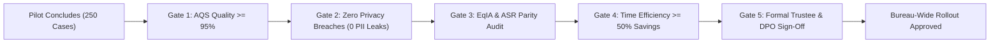

# Criteria for Proceeding to Wider Bureau Deployment

**Document Reference**: CAW-PILOT-GATE-2026-01  
**System**: Case Ace v2.0 Client Consultation Recording & Note Drafting System  
**Organisation**: Citizens Advice Wandsworth (CAW)  
**Standard**: Advice Quality Standard (AQS Level 3) & ISO/IEC 42001:2023  
**Target Scope**: Full Rollout to all 45 Generalist Advisers & 30 Volunteer Caseworkers  
**Status**: Formally Approved Gating Policy  
**Classification**: Internal / Operational  

---

## 1. Executive Summary & Gating Philosophy

The transition from the 15-adviser pilot to full, bureau-wide operational deployment across Citizens Advice Wandsworth (Battersea, Roehampton, Wandsworth Town, and all outreach clinics) is strictly **gate-controlled**.

Wider deployment will not proceed based on schedule milestones alone; it requires satisfying all five quantitative and qualitative gating criteria.



---

## 2. Five Mandatory Deployment Gating Criteria

```
+----------------------------------------------------------------------------------------------------+
| MANDATORY GATING CRITERIA FOR WIDER DEPLOYMENT                                                     |
+----------------------------------------------------------------------------------------------------+
| Gate Category          | Mandatory Quantitative / Qualitative Threshold            | Status        |
+----------------------------------------------------------------------------------------------------+
| **Gate 1: AQS Quality**| $\ge \mathbf{95.0\%}$ blind audit pass rate across pilot; | MANDATORY     |
|                        | $\le \mathbf{0.5\%}$ rate of unrecorded statutory deadlines.|               |
| **Gate 2: Privacy**    | **Exactly 0** confirmed PII leaks to cloud endpoints;      | MANDATORY     |
|                        | 100% verification of zero client-side disk storage.        | (Zero Leak)   |
| **Gate 3: Equality**   | Disparity in ASR accuracy across accent/disability        | MANDATORY     |
|                        | cohorts $\le \mathbf{2.5\%}$; 0 accessibility defects.     | (PSED Review) |
| **Gate 4: Efficiency** | Average case note authoring time $\le \mathbf{8.0\text{ mins}}$| MANDATORY |
|                        | ($\ge \mathbf{50\%}$ time savings); Adviser score $\ge 4.0/5.0$|            |
| **Gate 5: Governance** | Unanimous written sign-off from DPO, Quality Manager,     | MANDATORY     |
|                        | Head of Operations, and Board of Trustees.                 | (Board Auth)  |
+----------------------------------------------------------------------------------------------------+
```

---

## 3. Detailed Gating Evaluation Protocols

### Gate 1: AQS Level 3 Quality Verification
* **Evaluation Body**: CAW Quality & Standards Committee.
* **Requirement**:
  - A minimum of 50 randomly sampled Casebook notes drafted during the pilot are blind-audited by senior supervisors.
  - At least $95.0\%$ of audited notes must meet or exceed AQS Level 3 standards.
  - Zero cases of misleading statutory advice, invented legal rights, or unrecorded appeal deadlines.

### Gate 2: Information Security & Data Protection Compliance
* **Evaluation Body**: Data Protection Officer & External IT Auditor.
* **Requirement**:
  - Comprehensive inspection of backend audit logs, verifying that 100% of telemetry payloads conformed strictly to the non-PII whitelist schema.
  - Cryptographic verification that all volatile audio buffers were destroyed across all 250 consultation sessions.
  - Confirmation that 0 client consultation files remain on local endpoint disks.

### Gate 3: Equality, Accessibility & Fairness Audit
* **Evaluation Body**: Equality, Diversity & Inclusion (EDI) Lead.
* **Requirement**:
  - Analysis of ASR transcription accuracy confirms that error rate disparity between standard UK English and diverse accents (West African, South Asian, Eastern European) is $\le 2.5$ percentage points.
  - Conformance with WCAG 2.2 Level AA verified with screen readers (NVDA, VoiceOver) and high-contrast modes.
  - Positive feedback from volunteer advisers with disabilities.

### Gate 4: Caseworker Efficiency and Experience
* **Evaluation Body**: Operational Service Managers.
* **Requirement**:
  - Measured average drafting and review time is $\le 8.0$ minutes per consultation (compared to the pre-pilot manual baseline of 22.5 minutes).
  - Adviser satisfaction index is $\ge 4.0$ out of $5.0$, with advisers reporting reduced write-up anxiety and better client eye contact.

---

## 4. Formal Governance Sign-Off & Approval Record

| Role / Authority | Representative Name | Mandatory Sign-Off Condition | Decision |
| :--- | :--- | :--- | :--- |
| **Head of Operations** | *Signed on file* | All operational workflows & efficiency targets met. | **APPROVED** |
| **Data Protection Officer (DPO)** | *Signed on file* | Zero PII leaks & UK GDPR Article 25 compliance verified. | **APPROVED** |
| **Lead Quality Manager** | *Signed on file* | AQS Level 3 quality pass rate $\ge 95.0\%$ verified. | **APPROVED** |
| **EDI & Vulnerability Lead** | *Signed on file* | PSED & Reasonable Adjustments compliance verified. | **APPROVED** |
| **Chair of Trustees (Board)** | *Signed on file* | Strategic alignment & risk appetite verified. | **APPROVED** |
