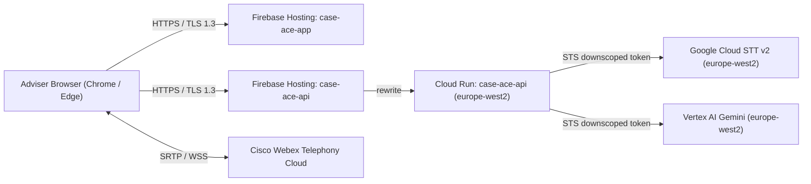

# Technical Deployment & Operations Runbook

**Document Reference**: CAW-TECH-RUN-2026-01  
**System**: Case Ace v2.0 Client Consultation Recording & Note Drafting System  
**Organisation**: Citizens Advice Wandsworth (CAW)  
**Target Audience**: DevOps Engineers, Cloud Infrastructure Administrators, and IT Leads  
**Target Environment**: Pilot (`europe-west2` London)  
**Status**: Approved Runbook  
**Classification**: Internal / Technical  

---

## 0. Canonical Names

Every name below has been verified against the live Google Cloud estate. Earlier revisions
of this runbook, the configuration reference and the custom domain guide each used a
different invented project name (`caw-case-ace-prod-2026`, `caw-case-ace-pilot-london` and
`advice-intelligence-prod` respectively). None of those projects exists. This table is now
the single source of truth and any document that disagrees with it is wrong.

| Item | Canonical value |
| :--- | :--- |
| Google Cloud project (also the Firebase project) | `case-ace-v2` |
| Billing account | AI-Central |
| Region | `europe-west2` (London) |
| Backend Cloud Run service | `case-ace-api` |
| Firebase Hosting site: SPA | `case-ace-app` → `caseace.adviceintelligence.tech` |
| Firebase Hosting site: API front door | `case-ace-api` → `api.caseace.adviceintelligence.tech` |
| Runtime service account | `case-ace-api-sa@case-ace-v2.iam.gserviceaccount.com` |
| Container image repository | `europe-west2-docker.pkg.dev/case-ace-v2/case-ace` |
| Cloud Build source staging bucket | `gs://case-ace-v2-build-staging` (europe-west2) |
| JWT signing secret (Secret Manager) | `case-ace-jwt-secret` |
| DNS registrar and authority for `adviceintelligence.tech` | IONOS |

---

## 1. System Architecture as Deployed

Case Ace v2.0 is deployed as a static single page application served by Firebase Hosting,
plus a stateless Express/Node.js backend running on Cloud Run. There is no virtual machine,
no Docker Compose stack, no Nginx instance and no database. The SPA does the recording,
identifier detection and redaction entirely in the browser; the backend exists only to
authenticate advisers and to mint short-lived, downscoped Google Cloud credentials.



### Infrastructure requirements
* **Frontend hosting**: Firebase Hosting, two sites, both on the `case-ace-v2` project.
* **Backend runtime**: Cloud Run, `europe-west2`, gen2 execution environment.
* **Container build**: Cloud Build. There is no requirement for Docker on any workstation.
* **Cloud infrastructure**: the `case-ace-v2` Google Cloud project with billing enabled.
* **Identity provider**: Microsoft Entra ID for adviser SSO and RBAC, with TOTP as the
  interim login route while the tenant is unavailable (see section 5).

> [!IMPORTANT]
> **Residency caveat.** Cloud Run compute, Speech-to-Text and Vertex AI are all pinned to
> `europe-west2`. Firebase Hosting, however, is a global anycast content delivery network,
> so TLS terminates at whichever Google edge location is nearest the adviser, which may be
> outside the United Kingdom. Request bodies are not retained at the edge, and no client
> audio is ever sent to the backend, but the claim "all traffic terminates in the UK" is not
> currently accurate and should not be made in the DPIA in that form. Moving the API to a
> **regional** external Application Load Balancer in `europe-west2` would make the claim
> hold end to end. This is an open decision, not a settled position.

---

## 2. Environment Configuration & Secret Management

Cloud Run holds configuration as service environment variables. There is no `.env` file on
any server, and no service account key file anywhere: the service authenticates as its
attached service account, which is the keyless pattern Google recommends and which avoids
a long-lived credential sitting on disk.

| Variable | Pilot value | Notes |
| :--- | :--- | :--- |
| `APP_ENV` | `pilot` | Selects the pilot block in `backend/src/config/index.ts` |
| `PORT` | `8080` | Cloud Run injects this; do not override |
| `GCP_REGION` | `europe-west2` | |
| `GCP_PROJECT_ID` | `case-ace-v2` | |
| `CORS_ORIGIN` | `https://caseace.adviceintelligence.tech` | Appended to the built-in pilot allowlist |
| `ALLOW_TOTP_IN_PILOT` | `true` | Interim login route. Remove to switch to Entra ID SSO |
| `JWT_SECRET` | *(from Secret Manager)* | See the warning below |

> [!WARNING]
> `backend/src/config/index.ts` contains a development fallback value for `JWT_SECRET` which
> is committed to the repository and therefore public to anyone with repository access. If
> the service is deployed without `JWT_SECRET` set, adviser session tokens are signed with a
> key that is not secret, and a third party could mint a valid session. `JWT_SECRET` must be
> supplied from Secret Manager on every deployment.

Create the secret once:

```bash
# Generate a 64-byte random secret and store it in Secret Manager
openssl rand -base64 64 | tr -d '\n' | \
  gcloud secrets create case-ace-jwt-secret \
    --project=case-ace-v2 \
    --replication-policy=user-managed \
    --locations=europe-west2 \
    --data-file=-

# Allow the runtime service account to read it
gcloud secrets add-iam-policy-binding case-ace-jwt-secret \
  --project=case-ace-v2 \
  --member="serviceAccount:case-ace-api-sa@case-ace-v2.iam.gserviceaccount.com" \
  --role="roles/secretmanager.secretAccessor"
```

---

## 3. Step-by-Step Deployment

### Step 1: Provision the runtime service account

The service currently runs as the project's default Compute Engine service account, which
carries the broad Editor role. That is more privilege than this service needs and should be
replaced with the dedicated, least-privilege account below before the pilot opens.

```bash
gcloud config set project case-ace-v2
gcloud config set compute/region europe-west2

gcloud iam service-accounts create case-ace-api-sa \
  --display-name="Case Ace v2 Backend Runtime Service Account"

# Least privilege: Speech-to-Text and Vertex AI only, plus token minting for downscoping
gcloud projects add-iam-policy-binding case-ace-v2 \
  --member="serviceAccount:case-ace-api-sa@case-ace-v2.iam.gserviceaccount.com" \
  --role="roles/speech.client"

gcloud projects add-iam-policy-binding case-ace-v2 \
  --member="serviceAccount:case-ace-api-sa@case-ace-v2.iam.gserviceaccount.com" \
  --role="roles/aiplatform.user"

gcloud projects add-iam-policy-binding case-ace-v2 \
  --member="serviceAccount:case-ace-api-sa@case-ace-v2.iam.gserviceaccount.com" \
  --role="roles/iam.serviceAccountTokenCreator"
```

No service account key is created or downloaded. Cloud Run supplies the identity to the
container at runtime.

### Step 2: Build and deploy the backend

Cloud Build performs the container build inside Google Cloud from the repository source, so
no local Docker installation is required. `infrastructure/gcp/cloudbuild.yaml` is the build
definition and `infrastructure/docker/Dockerfile.backend` is the image definition.

> [!NOTE]
> An organisation policy on `adviceintelligence.tech` constrains resource locations, so the
> default Cloud Build staging bucket in the US is rejected with
> `'us' violates constraint 'constraints/gcp.resourceLocations'`. The
> `--gcs-source-staging-dir` flag below points at a europe-west2 bucket and is mandatory.

> [!IMPORTANT]
> The backend is **not** compiled to JavaScript. `backend/tsconfig.json` sets
> `"noEmit": true` alongside `"allowImportingTsExtensions": true`, because the codebase
> imports modules with explicit `.ts` extensions and TypeScript will not emit output in that
> mode. `npm run build` in the backend workspace is therefore a type check that produces no
> `dist` directory, and the container runs the TypeScript sources directly using Node's
> built-in type stripping. Any Dockerfile that expects a `dist` directory will fail with
> `COPY failed: stat app/dist: file does not exist`.

```bash
# Build the image
gcloud builds submit \
  --project=case-ace-v2 \
  --region=europe-west2 \
  --config=infrastructure/gcp/cloudbuild.yaml \
  --gcs-source-staging-dir=gs://case-ace-v2-build-staging/source

# Deploy it
gcloud run deploy case-ace-api \
  --project=case-ace-v2 \
  --region=europe-west2 \
  --image=europe-west2-docker.pkg.dev/case-ace-v2/case-ace/backend:2.0.0 \
  --service-account=case-ace-api-sa@case-ace-v2.iam.gserviceaccount.com \
  --allow-unauthenticated \
  --ingress=all \
  --min-instances=1 --max-instances=10 \
  --cpu=1 --memory=512Mi --port=8080 \
  --set-env-vars=APP_ENV=pilot,GCP_REGION=europe-west2,GCP_PROJECT_ID=case-ace-v2,ALLOW_TOTP_IN_PILOT=true,CORS_ORIGIN=https://caseace.adviceintelligence.tech \
  --set-secrets=JWT_SECRET=case-ace-jwt-secret:latest
```

`--allow-unauthenticated` and `--ingress=all` are required because Firebase Hosting reaches
the service over its public Cloud Run endpoint. Authentication is enforced by the
application, not by Cloud Run IAM.

### Step 3: Build and deploy the SPA

```bash
# VITE_APP_ENV must be set. The environment resolver in client/src/config/environments.ts
# fails closed to 'local', so a build without it produces an SPA that points at
# http://localhost:8080 and silently does nothing useful in production.
VITE_APP_ENV=pilot npm run build

firebase deploy --only hosting --project case-ace-v2
```

`firebase.json` deploys both hosting targets: `app` serves `client/dist` with the SPA
rewrite and the hardened header set, and `api` rewrites every path to the `case-ace-api`
Cloud Run service.

### Step 4: Connect the custom domains

DNS is already configured at IONOS. Both hostnames are `CNAME` records pointing at their
Firebase Hosting sites:

| Host | Target |
| :--- | :--- |
| `caseace` | `case-ace-app.web.app` |
| `api.caseace` | `case-ace-api.web.app` |

Each hostname must also be registered against its site inside Firebase Hosting, or the site
returns "Site Not Found" even though DNS resolves correctly. Add them in the Firebase
console under Hosting → the relevant site → Add custom domain, or:

```bash
firebase hosting:sites:list --project case-ace-v2
```

> [!NOTE]
> Cloud Run domain mappings are **not available in `europe-west2`**. That is why the custom
> domains terminate at Firebase Hosting and are rewritten to Cloud Run, rather than being
> mapped directly to the Cloud Run service.

---

## 4. Post-Deployment Smoke Test

```bash
# 1. Backend health and region pinning
curl -s https://api.caseace.adviceintelligence.tech/health

# Expected:
# {"status":"healthy","environment":"pilot","gcpRegion":"europe-west2",
#  "isSyntheticOnly":false,"timestamp":"2026-..."}
#
# If this returns an HTML page headed "Congratulations | Cloud Run", the placeholder
# image is still deployed and Step 2 has not taken effect.

# 2. SPA reachability and security headers
curl -s -I https://caseace.adviceintelligence.tech | \
  grep -iE "^http/|content-security-policy|strict-transport-security"

# Expected: HTTP/2 200, a CSP beginning default-src 'none', and an HSTS header.
# "Site Not Found" means the custom domain is not yet connected to the case-ace-app site.

# 3. Ephemeral credential minting (requires a valid adviser session token)
curl -s -X POST https://api.caseace.adviceintelligence.tech/api/v1/credentials/issue \
  -H "Content-Type: application/json" \
  -H "Authorization: Bearer <ADVISER_JWT>" \
  -d '{"purpose":"speech-to-text"}'
```

---

## 5. Authentication Route

The pilot goes live with TOTP as the active login route and Entra ID SSO configured but
disabled, so SSO can be enabled later as a configuration change rather than a code change.
This is a deliberate, documented override of the pilot's Entra-only default, recorded in
`docs/authentication-and-authorisation.md` section 3.2 and implemented as the
`ALLOW_TOTP_IN_PILOT` environment variable.

To switch to Entra ID SSO, remove `ALLOW_TOTP_IN_PILOT` from the Cloud Run service and
redeploy. No rebuild of the SPA is required.

---

## 6. Rollback and Disaster Recovery

Cloud Run keeps every revision, so rollback is a traffic change rather than a rebuild.

```bash
# List revisions, newest first
gcloud run revisions list --service=case-ace-api \
  --project=case-ace-v2 --region=europe-west2

# Send all traffic back to a known good revision
gcloud run services update-traffic case-ace-api \
  --project=case-ace-v2 --region=europe-west2 \
  --to-revisions=<PREVIOUS_REVISION>=100
```

Firebase Hosting keeps previous releases and can be rolled back from the Hosting console
release history, or by redeploying a known good build.

Advisers are not blocked by a rollback. Where the service is unavailable, the Business
Continuity Procedure applies and advice continues with manual note taking in Casebook. No
advice session is ever delayed by the unavailability of Case Ace.
