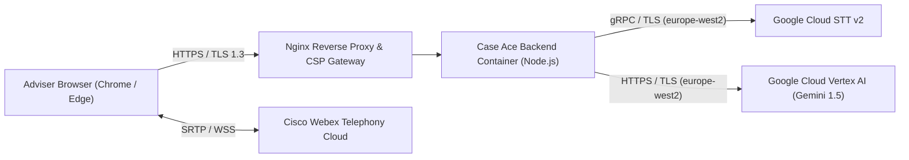

# Technical Deployment & Operations Runbook

**Document Reference**: CAW-TECH-RUN-2026-01  
**System**: Case Ace v2.0 Client Consultation Recording & Note Drafting System  
**Organisation**: Citizens Advice Wandsworth (CAW)  
**Target Audience**: DevOps Engineers, Cloud Infrastructure Administrators, and IT Leads  
**Target Environment**: Production / Pilot (`europe-west2` London)  
**Status**: Formally Approved Runbook  
**Classification**: Internal / Technical  

---

## 1. System Architecture & Prerequisites

Case Ace v2.0 is deployed as a high-security, containerised web service with an in-browser SPA frontend and an Express/Node.js backend proxy enforcing strict Content Security Policies (CSP) and zero-storage invariants.



### Hardware and Infrastructure Requirements
* **Application Host**: CAW Virtual Private Server (VPS) or Cloud VM (Ubuntu 24.04 LTS, 4 vCPU, 8 GB RAM, 50 GB SSD).
* **Container Runtime**: Docker Engine 26.0+ & Docker Compose v2.27+.
* **Reverse Proxy**: Nginx 1.26+ with TLS 1.3 and HSTS configured.
* **Cloud Infrastructure**: Google Cloud Project with Billing enabled, pinned to `europe-west2` (London).
* **Identity Provider**: Microsoft Entra ID (for Adviser Enterprise SSO Login screen and RBAC).

---

## 2. Environment Configuration & Secret Management

Create `/etc/case-ace/production.env` with restricted read permissions (`chmod 600`):

```bash
# ==============================================================================
# CASE ACE V2.0 PRODUCTION ENVIRONMENT CONFIGURATION (LONDON SOVEREIGN)
# ==============================================================================
NODE_ENV=production
PORT=4000
HOST=127.0.0.1
CORS_ORIGIN=https://caseace.adviceintelligence.tech

# Google Cloud Platform (STT v2 & Vertex AI) - PINNED STRICTLY TO europe-west2
GCP_PROJECT_ID=caw-case-ace-prod-2026
GCP_REGION=europe-west2
GOOGLE_APPLICATION_CREDENTIALS=/etc/case-ace/gcp-sa-key.json
GCP_SPEECH_RECOGNIZER=projects/caw-case-ace-prod-2026/locations/europe-west2/recognizers/chirp2-uk-english
GCP_VERTEX_MODEL=gemini-1.5-pro-002
GCP_VERTEX_DRAFT_TEMPERATURE=0.2

# Cisco Webex Integration (OAuth 2.0 PKCE)
WEBEX_CLIENT_ID=C4a9e218b3f40d...
WEBEX_CLIENT_SECRET=9f8a2b1c...
WEBEX_REDIRECT_URI=https://caseace.adviceintelligence.tech/api/auth/webex/callback
WEBEX_WEBHOOK_SECRET=e7b4c91a82f3...

# Microsoft Entra ID Authentication (Adviser Login Screen Only)
ENTRA_TENANT_ID=advice-intelligence-tenant-id
ENTRA_CLIENT_ID=case-ace-prod-client-id
ENTRA_REDIRECT_URI=https://caseace.adviceintelligence.tech/auth/callback

# Security, Sessions & Audit Logging
JWT_SECRET=super_secret_cryptographic_key_min_64_bytes...
AUDIT_LOG_RETENTION_DAYS=365
SESSION_IDLE_TIMEOUT_SECONDS=900
```

---

## 3. Step-by-Step Production Deployment

### Step 1: Provision Google Cloud IAM Service Account
```bash
# Set GCP Project and Region
gcloud config set project caw-case-ace-prod-2026
gcloud config set compute/region europe-west2

# Create dedicated runtime service account
gcloud iam service-accounts create case-ace-backend-sa \
  --display-name="Case Ace Backend Production Service Account"

# Grant least-privilege roles (STT Client & Vertex AI User only)
gcloud projects add-iam-policy-binding caw-case-ace-prod-2026 \
  --member="serviceAccount:case-ace-backend-sa@caw-case-ace-prod-2026.iam.gserviceaccount.com" \
  --role="roles/speech.client"

gcloud projects add-iam-policy-binding caw-case-ace-prod-2026 \
  --member="serviceAccount:case-ace-backend-sa@caw-case-ace-prod-2026.iam.gserviceaccount.com" \
  --role="roles/aiplatform.user"

# Download key to secure directory
gcloud iam service-accounts keys create /etc/case-ace/gcp-sa-key.json \
  --iam-account=case-ace-backend-sa@caw-case-ace-prod-2026.iam.gserviceaccount.com
chmod 600 /etc/case-ace/gcp-sa-key.json
```

---

### Step 2: Build and Launch Containers via Docker Compose
```bash
# Clone repository to deployment directory
cd /opt/case-ace-v2

# Run CI Lint and Storage Guard checks before building
npm run lint:storage-guard
node --experimental-strip-types scripts/test-phase15-17.mjs

# Build production container images
docker compose -f docker-compose.prod.yml build --no-cache

# Start background daemon
docker compose -f docker-compose.prod.yml up -d
```

---

### Step 3: Nginx Reverse Proxy & CSP Header Configuration
Configure `/etc/nginx/sites-available/case-ace.conf`:

```nginx
server {
    listen 443 ssl http2;
    server_name caseace.adviceintelligence.tech;

    ssl_certificate /etc/letsencrypt/live/caseace.adviceintelligence.tech/fullchain.pem;
    ssl_certificate_key /etc/letsencrypt/live/caseace.adviceintelligence.tech/privkey.pem;
    ssl_protocols TLSv1.2 TLSv1.3;
    ssl_ciphers HIGH:!aNULL:!MD5;

    # Mandatory Security Headers & Strict CSP
    add_header Strict-Transport-Security "max-age=63072000; includeSubDomains; preload" always;
    add_header X-Frame-Options "DENY" always;
    add_header X-Content-Type-Options "nosniff" always;
    add_header Referrer-Policy "strict-origin-when-cross-origin" always;
    add_header Content-Security-Policy "default-src 'none'; script-src 'self' 'wasm-unsafe-eval'; style-src 'self'; img-src 'self' data:; connect-src 'self' https://api.caseace.adviceintelligence.tech https://caseace.adviceintelligence.tech https://*.googleapis.com wss://*.webex.com; font-src 'self'; worker-src 'self' blob:; frame-ancestors 'none';" always;

    location / {
        proxy_pass http://127.0.0.1:4000;
        proxy_set_header Host $host;
        proxy_set_header X-Real-IP $remote_addr;
        proxy_set_header X-Forwarded-For $proxy_add_x_forwarded_for;
        proxy_set_header X-Forwarded-Proto https;
    }
}
```

---

## 4. Post-Deployment Smoke Test & Health Check Verification

Execute the automated health check suite:

```bash
# 1. Check HTTP Health Status & Cloud Connectivity
curl -s -i https://caseace.adviceintelligence.tech/api/health

# Expected Output:
# HTTP/2 200 OK
# Content-Type: application/json
# {"status":"healthy","gcpRegion":"europe-west2","database":"ok","version":"2.4.0"}

# 2. Run Live End-to-End Test Suite against Staging/Prod Endpoint
npm run test:prod-health
```

---

## 5. Rollback and Disaster Recovery

If an unrecoverable defect is discovered post-release:
```bash
# 1. Rollback container image to previous pinned release tag
docker compose -f docker-compose.prod.yml down
docker tag case-ace-backend:v2.3.9 case-ace-backend:latest
docker compose -f docker-compose.prod.yml up -d

# 2. Inform Bureau Advisers
# Advisers automatically continue via Business Continuity Procedure (manual note taking)
```
