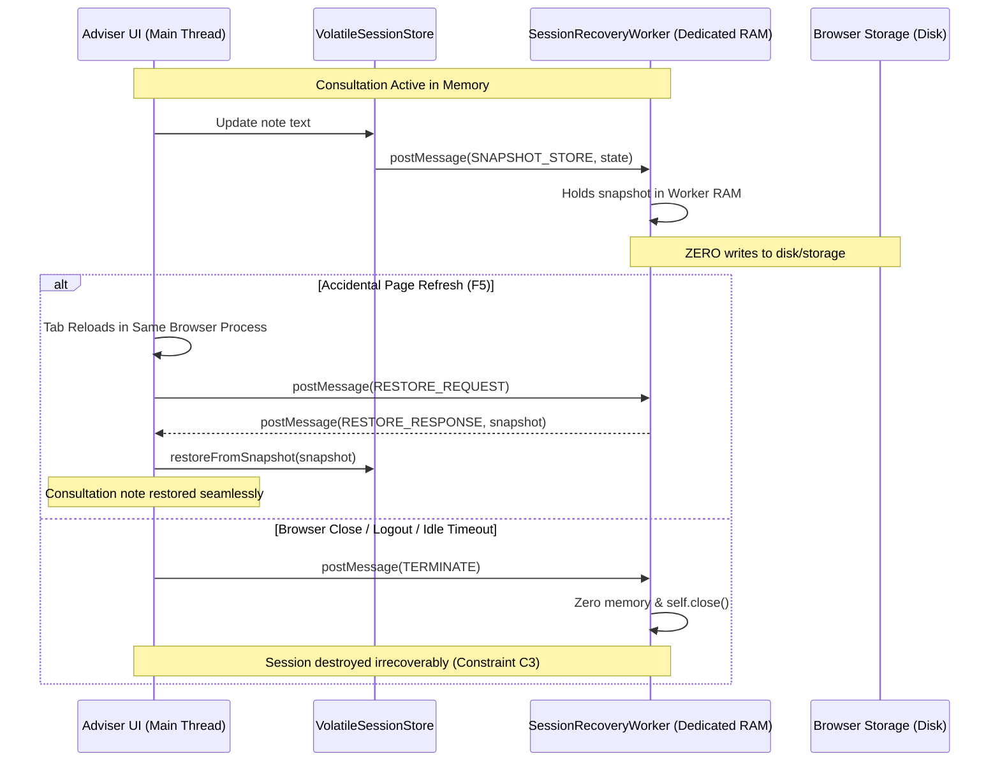

# Volatile Memory Discipline & Zero Persistence Architecture (Constraint C1)

## 1. Executive Summary & Regulatory Foundation

**Case Ace v2.0** is designed for advisers at **Citizens Advice Wandsworth (CAW)** to draft Advice Quality Standard (AQS) Level 3 case notes while handling special category client data (debt, benefits, housing, health, immigration). 

Under UK GDPR Article 9, the Data Protection Act 2018, and CAW information governance policies, client consultation data is subject to the strictest data minimisation and storage limitation principles:
* **Constraint C1 (Zero Client Data on Non-Volatile Storage)**: No client consultation data—including audio recordings, video streams, raw transcripts, anonymisation tokens, entity maps, or draft case notes—may ever be written to disk, persistent browser storage, or browser cache.
* **Constraint C3 (Zero Session Recovery Across Browser Restart)**: Closing the browser tab or terminating the browser process must irrecoverably destroy all session data.

This document details the architectural mechanisms, runtime guards, static lint rules, memory hygiene protocols, and hardware budgets that implement Constraint C1.

---

## 2. VolatileSessionStore Architecture

All consultation session data resides strictly within the singleton `VolatileSessionStore` in volatile client RAM. Nothing outside this store retains references to session buffers or PII.

```mermaid
flowchart TD
    subgraph Browser_RAM [Volatile Browser RAM (Heap Memory)]
        VSS[VolatileSessionStore Singleton]
        
        subgraph Session_Data [Session State Graph]
            RawAudio[Raw PCM Buffer: Float32Array 16kHz]
            RedactedAudio[Redacted PCM Buffer: Float32Array]
            LocalTrans[Pass 1 Local Draft Transcript]
            CloudTrans[Pass 2 Cloud Accurate Transcript]
            TokenMap[Token Map: Surrogate -> PII]
            TokenTrans[Tokenised Transcript]
            DraftNote[AQS Level 3 Draft Case Note]
            SignedNote[Signed Case Note]
        end

        VSS --> RawAudio
        VSS --> RedactedAudio
        VSS --> LocalTrans
        VSS --> CloudTrans
        VSS --> TokenMap
        VSS --> TokenTrans
        VSS --> DraftNote
        VSS --> SignedNote
        
        SRW[SessionRecoveryWorker (RAM Only)] <-->|postMessage (Snapshots)| VSS
    end

    subgraph Prohibited_Stores [Prohibited Non-Volatile Stores (Blocked by Guards)]
        LS[localStorage - BLOCKED]
        SS[sessionStorage - BLOCKED]
        IDB[IndexedDB - BLOCKED]
        CK[document.cookie - BLOCKED]
        CS[CacheStorage / SW - BLOCKED]
        FS[FileSystem Access API - BLOCKED]
    end

    VSS -.->|ILLEGAL WRITE ATTEMPTS| Prohibited_Stores
    style Prohibited_Stores fill:#fee2e2,stroke:#ef4444,stroke-width:2px;
    style Browser_RAM fill:#f0fdf4,stroke:#22c55e,stroke-width:2px;
```

### 2.1 Typed Accessors & Lifecycle Controls
The store exposes strictly typed accessors and mutators:
* `initSession(intakeType, adviserId)`: Spawns a fresh session state with a cryptographically random UUID.
* `getRawAudio()` / `setRawAudio(buf, duration, sampleRate)`: Manages raw audio PCM.
* `releaseRawAudio()`: Performs physical zeroing (`new Uint8Array(buf).fill(0)`) and unlinks the buffer reference as soon as acoustic redaction completes.
* `getRedactedAudio()` / `setRedactedAudio(buf)`: Holds redacted audio PCM.
* `releaseRedactedAudio()`: Zeroes and releases redacted audio memory once transmitted to Cloud Speech-to-Text v2.
* `setEntitiesAndTokenMap(entities, tokenMap)`: Stores local surrogate mappings in RAM.
* `destroySession()`: Overwrites all allocated audio buffers with zeros, clears all text/maps, triggers `SessionRecoveryWorker` memory destruction, and unlinks the state.

---

## 3. Storage Guards: Dual-Layer Defense

To prevent accidental writes to persistent storage from third-party libraries, future developer errors, or browser extensions, Case Ace v2.0 deploys a dual-layer defense:

### 3.1 Build-Time AST Static Lint Guard (`scripts/lint-storage-guard.mjs`)
The build pipeline executes a static AST scanner across all client source files (`client/src/**/*.ts`, `client/src/**/*.tsx`, `client/index.html`):
* Scans for banned identifiers: `localStorage`, `sessionStorage`, `indexedDB`, `document.cookie`, `window.caches`, `showSaveFilePicker`, `showOpenFilePicker`, `FileSystemFileHandle`, `FileSystemDirectoryHandle`.
* Fails the build immediately (`exit 1`) if any reference appears outside the explicitly allowlisted security guard definition itself (`client/src/security/storageGuard.ts`).

### 3.2 Runtime Monkey-Patching Guard (`client/src/security/storageGuard.ts`)
Executed at the very top of `client/src/main.tsx` before any UI component renders:
* Redefines property descriptors on `window.localStorage`, `window.sessionStorage`, `window.indexedDB`, `window.caches`, and `document.cookie`.
* Overrides `window.showSaveFilePicker` and `window.showOpenFilePicker`.
* Every getter, setter, and method invocation throws `VolatileStorageViolationError`:
  ```text
  [SECURITY VIOLATION - CONSTRAINT C1] Prohibited persistent client storage API 'localStorage.setItem' was accessed.
  Case Ace v2.0 strictly requires all session data to reside solely in volatile memory.
  ```

---

## 4. Service Worker Policy: Explicit Rejection

**Policy:** Case Ace v2.0 **does not register a Service Worker** (`serviceWorker: none`).

### Justification:
1. **Cache Leakage Risk**: Service workers act as network proxies with direct access to the `CacheStorage` API. Inadvertent wildcard route matching or library integration could result in caching unredacted audio streams, transcript fragments, or OAuth credential tokens to disk.
2. **Offline Mode Incompatibility**: Case Ace v2.0 is an enterprise web application operated within CAW advice bureaus and authorized home environments with managed connectivity. Offline session persistence would directly contradict Constraints C1 and C3.
3. **Simplified Security Surface**: Omitting a service worker eliminates background synchronization threads and persistent offline interception attack vectors.

---

## 5. Leaking Browser Features Suppression

Standard browser features designed for consumer convenience pose severe data leakage risks in a special category advice context:

| Browser Feature | Leakage Vector | Mitigation in Case Ace v2.0 |
| :--- | :--- | :--- |
| **Enhanced Spellcheck** | Sends typed text to cloud servers (e.g., Google or Microsoft) for grammar analysis. | `spellcheck="false"`, `data-gramm="false"`, and `data-enable-grammarly="false"` applied to all inputs, textareas, and contenteditable nodes. |
| **Form Autofill & History** | Browser persists field entries to local SQLite history profiles. | `autocomplete="off"`, `autocorrect="off"`, `autocapitalize="off"` on all session inputs. |
| **Automatic Page Translation** | Third-party translation services transmit full DOM text to external machine translation engines. | `translate="no"`, `class="notranslate"`, `<meta name="google" content="notranslate" />`, and `lang="en-GB"` on `<html>`, `<body>`, and `#root`. |
| **Crash & Error Dumps** | Unhandled React exceptions serialize component state and props into console logs or crash trackers. | [`ErrorBoundary.tsx`](file:///Users/mothership2/Library/CloudStorage/GoogleDrive-admin@adviceintelligence.tech/My%20Drive/Google%20AI%20Studio/case-ace-v2/client/src/components/ErrorBoundary.tsx) intercepts render errors, strips UK phone numbers, postcodes, and NINOs, and logs only sanitized operational error codes. |

---

## 6. Memory Hygiene & JavaScript Runtime Realities

### 6.1 Deterministic TypedArray Zeroing
Raw and redacted audio buffers represent the largest memory structures in Case Ace. Because audio data is stored in `ArrayBuffer` and `Float32Array` instances, Case Ace performs deterministic memory overwriting:
```typescript
if (this.state.rawAudioBuffer) {
  new Uint8Array(this.state.rawAudioBuffer).fill(0);
  this.state.rawAudioBuffer = null;
}
```
This guarantees that the underlying binary buffer is overwritten with zeros before reference deallocation.

### 6.2 Honest Disclosure of JavaScript String Immutability
**Regulatory Transparency**: While binary TypedArrays are deterministically zeroed, JavaScript engines (V8 in Chrome/Edge, SpiderMonkey in Firefox) treat strings as immutable and interned primitives. Once a string is allocated:
1. It cannot be modified in place.
2. It remains in V8 heap memory until reclaimed by the generational Garbage Collector (`Scavenge` / `Mark-Sweep`).
3. Garbage collection scheduling is non-deterministic and outside application control.

**Architectural Guarantee**: Case Ace minimizes string remanence by immediately unlinking references, avoiding duplicate string copies, and setting all state properties to `null`. However, Case Ace documentation explicitly and honestly notes that JavaScript provides no cryptographic guarantee of instant string wiping in RAM. Device-level BitLocker/FileVault encryption (enforced via Intune MDM) provides the baseline defense against swap file remanence.

---

## 7. Large Media Streaming Decode & Hardware Budget

### 7.1 Legacy Hardware Baseline at Citizens Advice Wandsworth
Advisers at CAW operate standard managed laptops with the following minimum hardware specifications:
* **RAM**: 8 GB LPDDR4 / DDR4
* **Available Browser Tab Memory Budget**: $\approx 1.5 \text{ GB} - 2.0 \text{ GB}$
* **CPU**: Quad-core Intel Core i5 (8th–11th Gen) or Apple Silicon M1/M2

### 7.2 Streaming Decode vs Full Video Frame Buffer Comparison
An imported 1-hour 1080p video file (30 fps) contains:
$$\text{Frames} = 3600 \text{ s} \times 30 \text{ fps} = 108,000 \text{ frames}$$
$$\text{Decoded RGBA Video Memory} = 108,000 \times (1920 \times 1080 \times 4 \text{ bytes}) \approx 895 \text{ GB}$$
Attempting to decode full video frames in browser memory causes instant tab crashing (Out of Memory / OOM).

### 7.3 Case Ace Streaming Decode Pipeline (`MediaStreamingDecoder`)
1. **Pre-flight Quota Validation**: Checks file size ($\le 500 \text{ MB}$) and file extension *before* memory allocation. Rejects oversized files immediately with guidance.
2. **Immediate Video Track Discard**: Decodes only the audio track via `AudioContext.decodeAudioData`, discarding all video frames during decoding.
3. **16kHz Mono Downmixing**: Converts multi-channel audio to single-channel 16kHz Float32 PCM:
   $$\text{RAM Footprint (1 Hour)} = 3600 \text{ s} \times 16,000 \text{ samples/s} \times 4 \text{ bytes/sample} \approx 230.4 \text{ MB}$$
   $230.4 \text{ MB}$ represents only $\approx 12\%$ of the available tab memory budget, allowing seamless execution on 8GB laptops.
4. **Duration Safety Cap**: Limits recordings to 90 minutes ($5,400 \text{ s}$).

---

## 8. Session Recovery Worker vs Constraint C3 Boundary

To protect advisers from losing uncopied case notes due to accidental page refreshes (e.g., accidental `F5` or `Ctrl+R`), Case Ace v2.0 implements a `SessionRecoveryWorker`:



### 8.1 The Strict C3 Boundary
* **Permitted**: Recovery across page reload within the *same active browser tab and process*, backed purely by Worker volatile heap memory.
* **Prohibited**: Session restoration across browser restart, new tab spawn, or application logout. The moment the browser process terminates, all Worker RAM is purged by the operating system.

---

## 9. Verification & Automated Test Evidence

Automated test suites in `scripts/run-tests.mjs` verify:
1. **Static AST Storage Linting**: 0 prohibited persistent storage APIs across all client source code.
2. **Runtime Storage Guard Exceptions**: Calling `localStorage`, `sessionStorage`, `indexedDB`, `document.cookie`, or `caches` throws `VolatileStorageViolationError`.
3. **100% Empty Browser Storage**: End-to-end consultation simulation leaves all browser storage mechanisms completely empty (0 keys, 0 databases, 0 cookies, 0 cache entries).
4. **TypedArray Memory Zeroing**: Audio buffers are filled with 0 on release.
5. **SessionRecoveryWorker Lifecycle**: State restored on reload simulation; Worker terminated on logout/timeout.
6. **Leaking Features Suppression**: `spellcheck="false"`, `autocomplete="off"`, `translate="no"` verified across all session inputs.
