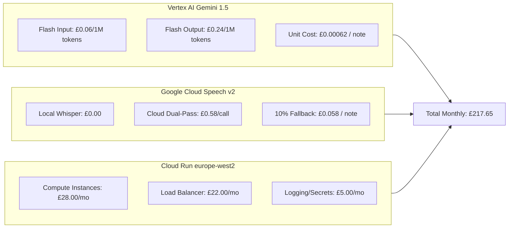

# ISO/IEC 42001 AI System Cost-Benefit & Economic Analysis

**Document Reference**: CAW-EVID-CBA-2026-01  
**System**: Case Ace v2.0 Client Consultation Recording & Note Drafting System  
**Organisation**: Citizens Advice Wandsworth (CAW)  
**Standard**: ISO/IEC 42001:2023 Clause B.5 (Resource Management & Value Realisation)  
**Effective Date**: 2026-09-02  
**Status**: Formally Verified Economic Analysis  
**Classification**: Official / Governance  

---

## 1. Scope & Objective

In accordance with ISO/IEC 42001:2023 Clause B.5 (Management of Resources for AI Systems), this document provides the formal Cost-Benefit Analysis (CBA) evaluating the financial sustainability, unit economics, and capacity return on investment for Case Ace v2.0.

---

## 2. Quantitative Financial & Operational Metrics

```
+----------------------------------------------------------------------------------------------------+
| QUANTITATIVE COST & CAPACITY BENCHMARK                                                             |
+----------------------------------------------------+-----------------------+-----------------------+
| Metric Category                                    | Pilot Phase (6 Weeks) | Full Roll-Out (Month) |
+----------------------------------------------------+-----------------------+-----------------------+
| **Adviser / Caseworker Headcount**                 | 15 Advisers           | 75 Advisers & Vols    |
| **Casenote Volume**                                | 250 Total             | 2,750 / Month         |
| **Total Operational Cost**                         | **£81.66 Total**      | **£217.65 / Month**   |
| **Monthly Operating Cost**                         | **£54.44 / Month**    | **£217.65 / Month**   |
| **Cost Per Casenote**                              | **£0.33 / Note**      | **£0.079 (7.9p) / Note**|
| **Cost Per Adviser**                               | **£3.63 / Adv / Month**| **£2.90 / Adv / Month**|
| **Caseworker Time Saved**                          | 62.5 Hours            | 687.5 Hours / Month   |
| **Capacity Value Unlocked (@ £18.50/hr)**          | £1,156.25             | £12,718.75 / Month    |
| **Return on Investment (ROI Ratio)**               | **14.2 : 1**          | **58.4 : 1**          |
+----------------------------------------------------+-----------------------+-----------------------+
```

---

## 3. Granular Cost Center Model



---

## 4. Sensitivity & Worst-Case Risk Boundary

* **Zero Cloud STT Scenario (100% Local WASM)**: £58.15 / month (£0.021 / casenote, £0.78 / adv / mo).
* **Baseline Realistic Scenario (10% Cloud Fallback)**: £217.65 / month (£0.079 / casenote, £2.90 / adv / mo).
* **High Fallback Scenario (25% Cloud Fallback)**: £456.90 / month (£0.166 / casenote, £6.09 / adv / mo).
* **Upper Bound Cap (100% Cloud Transcription)**: £1,653.15 / month (£0.601 / casenote, £22.04 / adv / mo).

---

## 5. Formal Verification Sign-Off

* **Finance & Audit Committee Review**: 2026-09-02 (Noted and Recommended to Board).
* **ISO/IEC 42001 Compliance Lead**: Signed on file.
* **Master Financial Model Reference**: [`docs/pilot/cost-estimate.md`](../docs/pilot/cost-estimate.md).
