# Case Ace v2.0 - Compliance Evidence Pack Index

**Organisation**: Citizens Advice Wandsworth (CAW)  
**System**: Case Ace v2.0 Client Consultation Recording & Note Drafting System  
**Version**: 2.4.0 (Production Pilot)  
**Date of Compilation**: 2026-09-02  
**Information Governance Lead**: Head of Operations, Citizens Advice Wandsworth  
**Technical Lead**: Lead Systems Architect / AI Technical Lead  

---

## 1. Compliance Statement & Boundary Notice

> [!IMPORTANT]
> **Declaration Regarding Standards Alignment & Certification**:
> This Compliance Evidence Pack documents the design, implementation, testing, and operational controls of Case Ace v2.0 against recognized international security and AI standards:
> - **ISO/IEC 27001:2022** (Information Security, Cybersecurity and Privacy Protection)
> - **ISO/IEC 42001:2023** (Artificial Intelligence Management System)
> - **UK General Data Protection Regulation (UK GDPR)** & **Data Protection Act 2018 (DPA 2018)**
> - **Web Content Accessibility Guidelines (WCAG) 2.2 Level AA**
> - **Advice Quality Standard (AQS Level 3 - Generalist & Casework)**
>
> **No claim of formal accredited third-party certification is made anywhere in this pack.** This evidence pack provides the factual, empirical, architectural, and procedural basis for CAW's internal Information Governance sign-off, Data Protection Impact Assessment (DPIA), and third-party audit verification.

---

## 2. Master Document Register

The Evidence Pack comprises 12 interconnected artifacts detailing every aspect of the Case Ace v2.0 architecture, privacy controls, AI safety measures, empirical benchmarks, and operational risk ownership:

| Document Reference | Title | Primary Scope / Standard | File Link |
| :--- | :--- | :--- | :--- |
| **DOC-01** | **ISO/IEC 27001:2022 Control Implementation Matrix** | Information Security & Cryptographic Controls (Annex A) | [`control_mapping_iso27001.md`](./control_mapping_iso27001.md) |
| **DOC-02** | **ISO/IEC 42001:2023 AI Management System Mapping** | AI Governance, Transparency, Impact & Human Oversight | [`iso_42001_mapping.md`](./iso_42001_mapping.md) |
| **DOC-03** | **End-to-End Data Flow & Trust Boundary Map** | Data Flow Architecture, Boundaries & Cryptographic Transits | [`data_flow_diagram.md`](./data_flow_diagram.md) |
| **DOC-04** | **UK GDPR Article 30 Record of Processing Activities** | ROPA Entry for CAW Information Governance Register | [`ropa_entry.md`](./ropa_entry.md) |
| **DOC-05** | **Cloud & Sub-Processor Compliance Register** | Google Cloud, Vertex AI, Cisco Webex, Entra ID Contracts | [`processor_register.md`](./processor_register.md) |
| **DOC-06** | **Cisco Webex Integration Registration Record** | Telephony API Scopes, OAuth App & Consent Verification | [`webex_integration_record.md`](./webex_integration_record.md) |
| **DOC-07** | **Case Note Drafting Engine Model Card** | Model Specs, Prompts, Boundaries & Evaluation Metrics | [`model_card.md`](./model_card.md) |
| **DOC-08** | **Synthetic Corpus Redaction Performance Report** | Empirical Benchmark (Recall, Precision, 0-PII Interception) | [`redaction_performance_report.md`](./redaction_performance_report.md) |
| **DOC-09** | **Penetration Test & Security Assessment Report** | Threat Model (STRIDE), Injection Resistance & Remediation | [`penetration_test_report.md`](./penetration_test_report.md) |
| **DOC-10** | **WCAG 2.2 AA Accessibility Conformance Report** | VPAT Evaluation (Screen Reader, High Contrast, Navigation) | [`accessibility_conformance_report.md`](./accessibility_conformance_report.md) |
| **DOC-11** | **SBOM & Dependency Governance Justification** | CycloneDX SBOM, Zero-Telemetry Verification & Licenses | [`sbom_justification.md`](./sbom_justification.md) |
| **DOC-12** | **Operational Residual Risk & Ownership Register** | Named Risk Owners, Compensating Controls & Sign-Offs | [`residual_risk_register.md`](./residual_risk_register.md) |

---

## 3. Core Architectural Invariants (Constraints C1 to C8)

All compliance documents map back to the eight non-negotiable architectural constraints enforced throughout Case Ace v2.0:

```mermaid
graph TD
    C1[C1: Ephemeral Audio in Volatile RAM] --> G1[Gate: Phase 9 Review]
    C2[C2: Zero Unredacted Client Audio to Cloud] --> G2[Verification: Phase 10]
    C3[C3: Local-First Identifier Detection & Redaction] --> G1
    C4[C4: Immediate Acoustic Erasure on Verification] --> G2
    C5[C5: Surrogate Tokenisation Before LLM Egress] --> LLM[Cloud LLM Note Drafting]
    C6[C6: In-Browser Client Re-Identification] --> ADV[Adviser Professional Sign-off]
    C7[C7: Deterministic Single Session Destruction] --> END[All 6 Exit Paths Zeroed]
    C8[C8: Fail-Closed Security Stance] --> FAIL[Abort Egress if ANY PII Survives]

    style C1 fill:#e1f5fe,stroke:#0288d1,stroke-width:2px;
    style C2 fill:#e8f5e9,stroke:#388e3c,stroke-width:2px;
    style C3 fill:#fff3e0,stroke:#f57c00,stroke-width:2px;
    style C4 fill:#e8f5e9,stroke:#388e3c,stroke-width:2px;
    style C5 fill:#ede7f6,stroke:#512da8,stroke-width:2px;
    style C6 fill:#fce4ec,stroke:#c2185b,stroke-width:2px;
    style C7 fill:#ffebee,stroke:#d32f2f,stroke-width:2px;
    style C8 fill:#ffebee,stroke:#d32f2f,stroke-width:2px;
```

---

## 4. Cross-Reference & Verification Matrix

| Invariant / Requirement | Enforcing Code Module | Automated Test Suite | Supporting Compliance Evidence |
| :--- | :--- | :--- | :--- |
| **C1 / C4: Zero Disk Persistence** | `client/src/security/storageGuard.ts` `client/src/state/volatileStore.ts` | `scripts/lint-storage-guard.mjs` `test/volatileStorage.test.ts` | `control_mapping_iso27001.md` (A.8.24, A.8.33) `residual_risk_register.md` (RISK-01) |
| **C2 / C8: UK Sovereign STT & Data Logging Prevention** | `client/src/asr/ukCloudTranscriber.ts` `client/src/audio/audioRedactionEngine.ts` | `scripts/run-tests.mjs` (Suite 12) `test/testingEngine.ts` | `control_mapping_iso27001.md` (A.5.34) `redaction_performance_report.md` |
| **C3: Multi-Layer NER** | `client/src/redaction/layer1StructuredMatcher.ts` `client/src/redaction/layer2UnstructuredNer.ts` `client/src/redaction/layer3SpecialCategoryClassifier.ts` | `scripts/test-phase15-17.mjs` `test/corpus/syntheticAdviceCorpus.ts` | `iso_42001_mapping.md` (Data Governance) `redaction_performance_report.md` |
| **C5 / C6: Tokenisation & Local Re-Identification** | `client/src/tokenisation/tokenisationEngine.ts` `backend/src/prompts/caseRecordingMasterPrompt.ts` | `test/tokenisation.test.ts` `scripts/test-phase15-17.mjs` | `model_card.md` `data_flow_diagram.md` |
| **C7: Deterministic Destruction** | `client/src/state/sessionDestruction.ts` `client/src/state/idleTimeout.ts` | `scripts/test-phase15-17.mjs` (Suite 9) | `control_mapping_iso27001.md` (A.8.10) `residual_risk_register.md` (RISK-01) |
| **Privacy & Zero-Telemetry Logging** | `backend/src/logging/logSchema.ts` `backend/src/logging/logStore.ts` | `scripts/test-phase15-17.mjs` (Suite 10) | `ropa_entry.md` `control_mapping_iso27001.md` (A.8.15) |
| **Supply Chain Governance** | `package.json` `docs/dependencies.md` | `scripts/run-tests.mjs` (Suite 1) | `sbom_justification.md` `sbom.json` |
