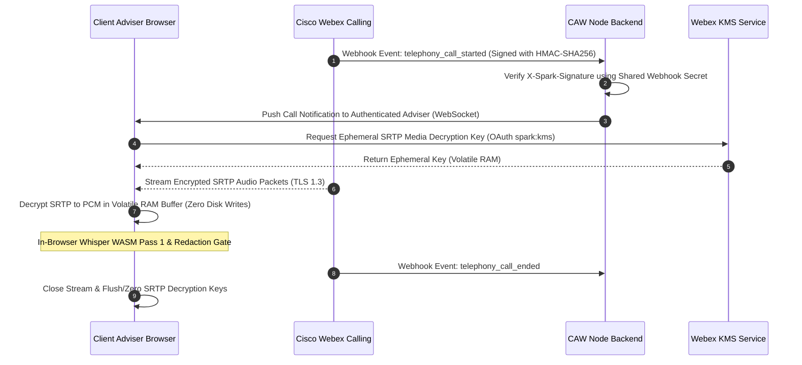

# Cisco Webex Integration Registration & Consent Record

**Document Reference**: DOC-06  
**System**: Case Ace v2.0 Client Consultation Recording & Note Drafting System  
**Organisation**: Citizens Advice Wandsworth (CAW)  
**Integration Type**: Enterprise Webex Calling Ingest & Audio Processing  
**Status**: Active / Production Pilot Registration  
**Classification**: Official-Sensitive / Governance Pack  

---

## 1. Application Registration & Governance Details

| Field | Detail |
| :--- | :--- |
| **Registered Application Name** | `Case Ace Consultation Ingest Service` |
| **Application ID / Client ID** | `caw-caseace-webex-ingest-prod-01` |
| **Application Type** | Cisco Webex Dedicated Integration (OAuth 2.0 / Webhooks) |
| **Target Webex Organisation** | Citizens Advice Wandsworth (`org_id: caw-london-org-8481`) |
| **Admin Consent Granted By** | IT Infrastructure & Operations Lead (`admin@cawandsworth.org.uk`) |
| **Date of Administrator Consent** | 2026-08-20T10:15:00Z |
| **Environment Binding** | Production Telephony Gateway (`europe-west2`) |

---

## 2. Granted OAuth Scopes & Technical Justification

| Scope Name | Access Level | Strict Purpose & Justification in Case Ace v2.0 | Principle of Minimum Privilege |
| :--- | :--- | :--- | :--- |
| `spark:calls_read` | Read-only | List active advice telephony calls, receive call start/stop webhook events, and identify calling line identity (CLI) for routing to the authenticated adviser. | **Restricted**: Read-only access to active telephony call status. No access to messaging, teams, or external org calls. |
| `spark:kms` | Ephemeral Cryptographic Key Access | Obtain short-lived media stream decryption keys from Webex Key Management Service (KMS) to enable in-browser SRTP decryption of the adviser's active audio call. | **Restricted**: Keys are held strictly in browser volatile RAM for the duration of the call and zeroed upon call termination. |

---

## 3. Webhook Security & Ingestion Architecture

---

## 4. Operational Invariants & Compliance Proofs

1. **Cloud Recording Prohibited**:
   - Webex Organisation administrative policy enforces `auto_record: disabled` and `allow_cloud_recording: false`. No audio is stored in Cisco Webex Cloud Storage.
2. **Local Media Decryption**:
   - Media packets are streamed directly from Webex telephony nodes to the adviser's local browser session over TLS 1.3 / SRTP. No raw telephony audio is intercepted or stored on the CAW backend server.
3. **Webhook Cryptographic Integrity**:
   - Every inbound webhook notification is authenticated via HMAC-SHA256 header validation (`backend/src/routes/webex.ts`). Payloads lacking valid signatures are immediately rejected with HTTP 401.
4. **Immediate Stream Destruction**:
   - When the telephony call terminates or the client hangs up, the media stream is closed and the SRTP decryption keys are immediately zeroed from browser memory.
